# BlueHub Platform - System Design

## Document Information
**Version:** 1.0  
**Last Updated:** 2026-06-10  
**Status:** Draft  

---

## Table of Contents
1. [Architecture Overview](#1-architecture-overview)
2. [System Architecture Diagram](#2-system-architecture-diagram)
3. [Data Flow Diagrams](#3-data-flow-diagrams)
4. [Database Design (ERD)](#4-database-design-erd)
5. [API Endpoints Specification](#5-api-endpoints-specification)
6. [Paymenter Integration](#6-paymenter-integration)
7. [Module Registry & Feature Flags](#7-module-registry--feature-flags)
8. [Internationalization (i18n)](#8-internationalization-i18n)
9. [Security Architecture](#9-security-architecture)
10. [Deployment Architecture](#10-deployment-architecture)

---

## 1. Architecture Overview

### 1.1 High-Level Architecture Principles

BlueHub follows these core architectural principles:

1. **API-First:** All business logic resides in FastAPI. Clients are thin and stateless.
2. **Modular Design:** Services are plug-and-play modules with zero interdependency.
3. **Multi-Tenant:** Single installation serves multiple brands/resellers with isolated data.
4. **Event-Driven:** Celery tasks handle async operations (provisioning, monitoring, renewals).
5. **Cache-Heavy:** Redis caches feature flags, user sessions, and frequently accessed data.
6. **Polyglot Persistence:** PostgreSQL for relational data, Redis for cache/queue, MinIO for object storage.

### 1.2 Technology Stack

| Layer | Technology | Version | Purpose |
|-------|-----------|---------|---------|
| Backend API | FastAPI | 0.104+ | REST API, OpenAPI documentation |
| Bot | aiogram | 3.x | Telegram bot framework |
| Web Client | Next.js | 15.x | Client portal (white-label) |
| Admin Panel | Next.js + Shadcn | 15.x | Admin dashboard |
| Database | PostgreSQL | 16.x | Primary data store |
| Cache/Queue | Redis | 7.x | Session cache, Celery broker |
| Task Queue | Celery | 5.x | Async background jobs |
| Object Storage | MinIO | Latest | File/backup storage |
| Monitoring | Prometheus + Grafana | Latest | Metrics and dashboards |
| Logging | ELK Stack | 8.x | Centralized logging |
| Container | Docker | 24.x | Development environment |
| Orchestration | Kubernetes | 1.28+ | Production deployment (future) |

---

## 2. System Architecture Diagram

```mermaid
graph TB
    subgraph "Client Layer"
        TG[Telegram Bot<br/>aiogram 3]
        WEB[Web Portal<br/>Next.js 15]
        ADMIN[Admin Panel<br/>Next.js 15]
        MOBILE[Mobile App<br/>Future]
    end

    subgraph "API Gateway Layer"
        NGINX[NGINX<br/>Reverse Proxy]
    end

    subgraph "Application Layer"
        API[FastAPI Core<br/>Python 3.12]
        
        subgraph "Core Modules"
            AUTH[Auth & JWT]
            RBAC[RBAC Engine]
            I18N[i18n Engine]
            REGISTRY[Module Registry]
            AUDIT[Audit Logger]
            NOTIF[Notifications]
        end
        
        subgraph "Service Modules"
            VPN[VPN Module]
            VPS[VPS Module]
            DNS[SmartDNS Module]
            STREAM[Streaming Module]
            GAME[Game Server Module]
        end
    end

    subgraph "Task Queue Layer"
        CELERY[Celery Workers]
        BEAT[Celery Beat<br/>Scheduler]
    end

    subgraph "Data Layer"
        PG[(PostgreSQL 16<br/>Primary DB)]
        REDIS[(Redis 7<br/>Cache + Broker)]
        MINIO[(MinIO<br/>Object Storage)]
    end

    subgraph "External Services"
        PAYMENTER[Paymenter<br/>Billing System]
        PROXMOX[Proxmox VE<br/>VM Management]
        WIREGUARD[WireGuard<br/>VPN Backend]
        MAXMIND[MaxMind<br/>Fraud Detection]
    end

    subgraph "Monitoring Layer"
        PROM[Prometheus]
        GRAFANA[Grafana]
        ELK[ELK Stack]
    end

    TG --> NGINX
    WEB --> NGINX
    ADMIN --> NGINX
    MOBILE -.-> NGINX

    NGINX --> API

    API --> AUTH
    API --> RBAC
    API --> I18N
    API --> REGISTRY
    API --> AUDIT
    API --> NOTIF
    
    API --> VPN
    API --> VPS
    API --> DNS
    API --> STREAM
    API --> GAME

    API --> CELERY
    BEAT --> CELERY

    API --> PG
    API --> REDIS
    CELERY --> PG
    CELERY --> REDIS
    CELERY --> MINIO

    API <--> PAYMENTER
    CELERY --> PROXMOX
    CELERY --> WIREGUARD
    API --> MAXMIND

    API --> PROM
    GRAFANA --> PROM
    API --> ELK
    CELERY --> ELK

    style API fill:#4CAF50
    style CELERY fill:#FF9800
    style PG fill:#336791
    style REDIS fill:#DC382D
    style PAYMENTER fill:#9C27B0
```

---

## 3. Data Flow Diagrams

### 3.1 Service Purchase Flow

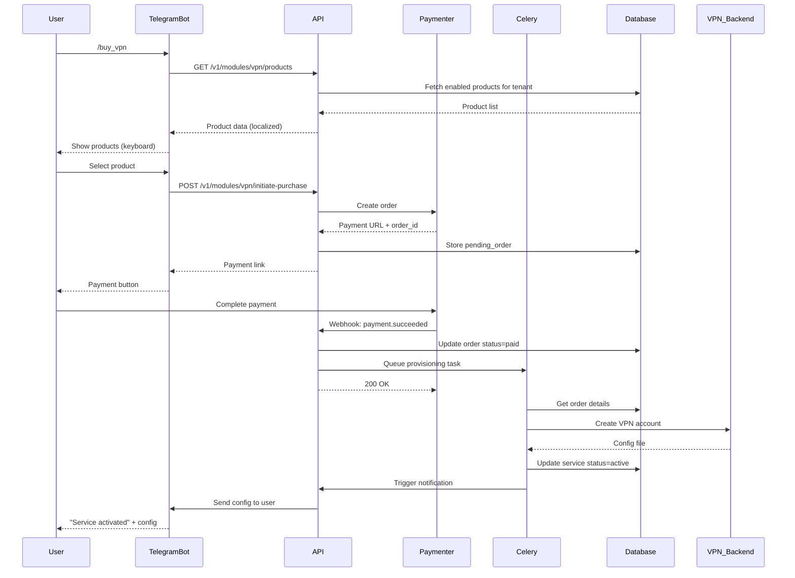

### 3.2 Module Enable/Disable Flow

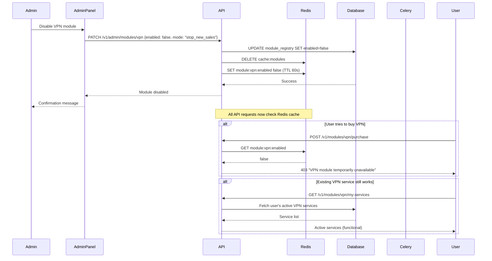

### 3.3 Multi-Tenant Request Routing

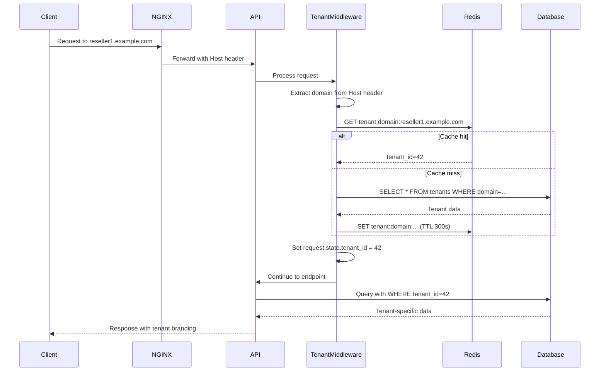

---

## 4. Database Design (ERD)

### 4.1 Core Schema

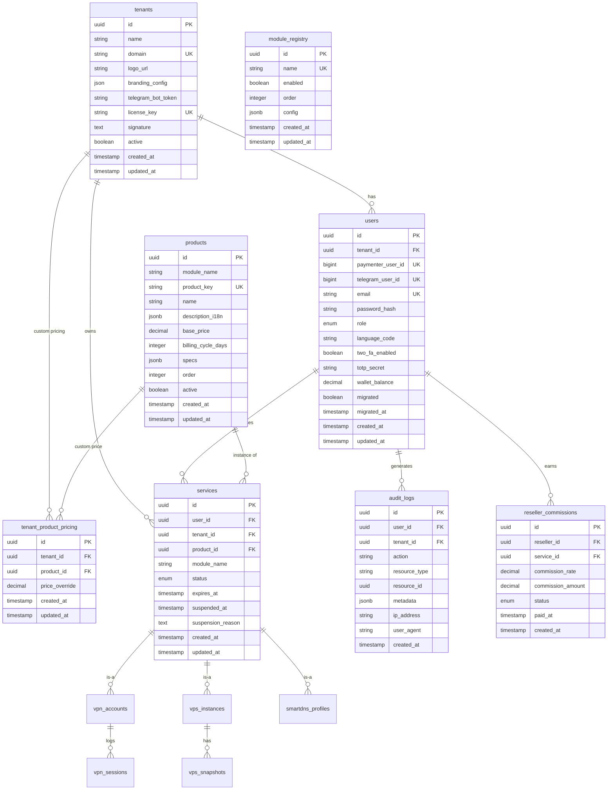

### 4.2 VPN Module Schema

```mermaid
erDiagram
    services ||--|| vpn_accounts : extends
    vpn_accounts ||--o{ vpn_sessions : logs
    vpn_accounts ||--o{ vpn_protocol_configs : has

    vpn_accounts {
        uuid id PK
        uuid service_id FK UK
        string username UK
        enum protocol
        string server_location
        string server_ip
        integer server_port
        bigint traffic_limit_bytes
        bigint traffic_used_bytes
        integer max_concurrent_sessions
        timestamp last_connected_at
        timestamp created_at
        timestamp updated_at
    }

    vpn_protocol_configs {
        uuid id PK
        uuid vpn_account_id FK
        enum protocol
        text public_key
        text private_key
        text config_file
        jsonb metadata
        timestamp created_at
        timestamp updated_at
    }

    vpn_sessions {
        uuid id PK
        uuid vpn_account_id FK
        string client_ip
        timestamp connected_at
        timestamp disconnected_at
        bigint bytes_sent
        bigint bytes_received
        string disconnect_reason
    }
```

### 4.3 VPS Module Schema

```mermaid
erDiagram
    services ||--|| vps_instances : extends
    vps_instances ||--o{ vps_snapshots : has

    vps_instances {
        uuid id PK
        uuid service_id FK UK
        integer proxmox_vmid UK
        string proxmox_node
        string hostname
        string primary_ip
        integer vcpu_cores
        integer ram_mb
        integer disk_gb
        string os_template
        string root_password
        enum power_status
        timestamp last_boot_at
        timestamp created_at
        timestamp updated_at
    }

    vps_snapshots {
        uuid id PK
        uuid vps_instance_id FK
        string snapshot_name UK
        string proxmox_snapshot_id
        bigint size_bytes
        text description
        timestamp created_at
    }
```

### 4.4 SmartDNS Module Schema

```mermaid
erDiagram
    services ||--|| smartdns_profiles : extends
    smartdns_profiles ||--o{ dns_records : manages

    smartdns_profiles {
        uuid id PK
        uuid service_id FK UK
        string profile_name UK
        string dns_server_ip
        integer dns_server_port
        boolean anycast_enabled
        jsonb filtering_rules
        timestamp created_at
        timestamp updated_at
    }

    dns_records {
        uuid id PK
        uuid profile_id FK
        string domain
        enum record_type
        string value
        integer ttl
        timestamp created_at
        timestamp updated_at
    }
```

### 4.5 Complete Database Schema Summary

| Table Name | Module | Row Count Estimate | Critical Indexes |
|-----------|--------|-------------------|------------------|
| `tenants` | Core | 100-1000 | domain, license_key |
| `users` | Core | 10K-1M | email, telegram_user_id, tenant_id |
| `products` | Core | 50-200 | module_name, product_key |
| `services` | Core | 50K-5M | user_id, tenant_id, status, expires_at |
| `module_registry` | Core | 5-20 | name, enabled |
| `audit_logs` | Core | 10M+ (partitioned) | user_id, created_at, action |
| `vpn_accounts` | VPN | 30K-3M | service_id, username, server_location |
| `vpn_sessions` | VPN | 100M+ (partitioned) | vpn_account_id, connected_at |
| `vps_instances` | VPS | 5K-500K | service_id, proxmox_vmid |
| `smartdns_profiles` | SmartDNS | 5K-100K | service_id, profile_name |

---

## 5. API Endpoints Specification

### 5.1 API Versioning Strategy

- Base URL: `https://api.bluehub.com/v1/`
- Versioning: URL path-based (`/v1/`, `/v2/`)
- Deprecation: v1 supported for minimum 12 months after v2 release

### 5.2 Authentication Endpoints

#### POST /v1/auth/register
**Description:** Register new user account  
**Authentication:** None  
**Request Body:**
```json
{
  "email": "user@example.com",
  "password": "SecurePass123!",
  "telegram_user_id": 123456789,
  "language_code": "fa"
}
```
**Response:** `201 Created`
```json
{
  "user_id": "uuid",
  "email": "user@example.com",
  "access_token": "eyJ...",
  "refresh_token": "eyJ...",
  "expires_in": 3600
}
```

#### POST /v1/auth/login
**Description:** Login with email/password or Telegram  
**Authentication:** None  
**Request Body:**
```json
{
  "email": "user@example.com",
  "password": "SecurePass123!"
}
```
**Response:** `200 OK`
```json
{
  "access_token": "eyJ...",
  "refresh_token": "eyJ...",
  "expires_in": 3600,
  "user": {
    "id": "uuid",
    "email": "user@example.com",
    "role": "user",
    "language_code": "fa"
  }
}
```

#### POST /v1/auth/refresh
**Description:** Refresh access token
  
**Authentication:** Bearer (refresh_token)  
**Response:** `200 OK`

#### POST /v1/auth/2fa/enable
**Description:** Enable 2FA for user  
**Authentication:** Bearer (access_token)  
**Response:** `200 OK`
```json
{
  "qr_code_url": "data:image/png;base64,...",
  "secret": "JBSWY3DPEHPK3PXP",
  "backup_codes": ["12345678", "87654321"]
}
```

### 5.3 Module Management Endpoints

#### GET /v1/modules
**Description:** List all available modules with enabled status  
**Authentication:** Bearer (access_token)  
**Response:** `200 OK`
```json
{
  "modules": [
    {
      "name": "vpn",
      "enabled": true,
      "display_name": {
        "en": "VPN Service",
        "fa": "سرویس VPN"
      },
      "icon": "shield",
      "order": 1
    },
    {
      "name": "vps",
      "enabled": false,
      "display_name": {
        "en": "Virtual Private Server",
        "fa": "سرور مجازی"
      },
      "icon": "server",
      "order": 2
    }
  ]
}
```

### 5.4 VPN Module Endpoints

#### GET /v1/modules/vpn/products
**Description:** List available VPN products for tenant  
**Authentication:** Bearer (access_token)  
**Query Parameters:**
- `protocol` (optional): wireguard, vless, trojan, shadowsocks
- `location` (optional): DE, NL, TR

**Response:** `200 OK`
```json
{
  "products": [
    {
      "id": "uuid",
      "name": "VPN Premium 1TB",
      "description": {
        "en": "Premium VPN with 1TB traffic",
        "fa": "VPN پرمیوم با ۱ ترابایت ترافیک"
      },
      "protocol": "wireguard",
      "traffic_limit_gb": 1024,
      "billing_cycle_days": 30,
      "price": {
        "amount": 9.99,
        "currency": "USD"
      },
      "available_locations": ["DE", "NL", "TR"]
    }
  ]
}
```

#### POST /v1/modules/vpn/purchase
**Description:** Initiate VPN purchase (creates order in Paymenter)  
**Authentication:** Bearer (access_token)  
**Request Body:**
```json
{
  "product_id": "uuid",
  "location": "DE",
  "billing_cycle": 30
}
```
**Response:** `201 Created`
```json
{
  "order_id": "uuid",
  "payment_url": "https://billing.bluehub.com/pay/abc123",
  "amount": 9.99,
  "currency": "USD",
  "expires_at": "2026-06-10T12:00:00Z"
}
```

#### GET /v1/modules/vpn/services
**Description:** List user's VPN services  
**Authentication:** Bearer (access_token)  
**Query Parameters:**
- `status` (optional): active, suspended, expired

**Response:** `200 OK`
```json
{
  "services": [
    {
      "id": "uuid",
      "product_name": "VPN Premium 1TB",
      "protocol": "wireguard",
      "server_location": "DE",
      "server_ip": "1.2.3.4",
      "server_port": 51820,
      "status": "active",
      "traffic_used_gb": 123.45,
      "traffic_limit_gb": 1024,
      "expires_at": "2026-07-10T12:00:00Z",
      "created_at": "2026-06-10T12:00:00Z"
    }
  ]
}
```

#### GET /v1/modules/vpn/services/{service_id}/config
**Description:** Download VPN configuration file  
**Authentication:** Bearer (access_token)  
**Response:** `200 OK`
```json
{
  "config_type": "wireguard",
  "config_file": "[Interface]\nPrivateKey = ...\n...",
  "qr_code": "data:image/png;base64,...",
  "connection_instructions": {
    "en": "1. Install WireGuard app...",
    "fa": "۱. برنامه WireGuard را نصب کنید..."
  }
}
```

#### GET /v1/modules/vpn/services/{service_id}/usage
**Description:** Get real-time usage statistics  
**Authentication:** Bearer (access_token)  
**Response:** `200 OK`
```json
{
  "traffic_used_bytes": 132831232000,
  "traffic_limit_bytes": 1099511627776,
  "usage_percentage": 12.08,
  "current_sessions": 2,
  "max_concurrent_sessions": 5,
  "last_connected_at": "2026-06-10T10:30:00Z"
}
```

### 5.5 Admin Endpoints

#### GET /v1/admin/modules
**Description:** Manage module registry (superadmin only)  
**Authentication:** Bearer (access_token) + Role: superadmin  
**Response:** `200 OK`
```json
{
  "modules": [
    {
      "name": "vpn",
      "enabled": true,
      "order": 1,
      "config": {
        "max_services_per_user": 5,
        "default_protocol": "wireguard"
      },
      "active_services_count": 1234
    }
  ]
}
```

#### PATCH /v1/admin/modules/{module_name}
**Description:** Update module configuration  
**Authentication:** Bearer (access_token) + Role: superadmin  
**Request Body:**
```json
{
  "enabled": false,
  "disable_mode": "stop_new_sales",
  "config": {
    "max_services_per_user": 10
  }
}
```
**Response:** `200 OK`

#### POST /v1/admin/tenants
**Description:** Create new tenant (white-label)
  
**Authentication:** Bearer (access_token) + Role: superadmin  
**Request Body:**
```json
{
  "name": "Reseller A",
  "domain": "reseller-a.example.com",
  "branding_config": {
    "primary_color": "#4CAF50",
    "logo_url": "https://cdn.example.com/logo.png"
  },
  "telegram_bot_token": "123456:ABC-DEF..."
}
```
**Response:** `201 Created`
```json
{
  "tenant_id": "uuid",
  "license_key": "BH-XXXX-XXXX-XXXX",
  "signature": "-----BEGIN SIGNATURE-----..."
}
```

#### GET /v1/admin/abuse-reports
**Description:** List abuse reports  
**Authentication:** Bearer (access_token) + Role: admin  
**Response:** `200 OK`
```json
{
  "reports": [
    {
      "id": "uuid",
      "service_id": "uuid",
      "user_email": "user@example.com",
      "abuse_type": "spam",
      "detected_at": "2026-06-10T09:00:00Z",
      "auto_suspended": true,
      "evidence": {
        "smtp_connections": 1500,
        "port_25_blocked": true
      }
    }
  ]
}
```

### 5.6 Webhook Endpoints

#### POST /webhooks/paymenter/user.created
**Description:** Paymenter user creation webhook  
**Authentication:** Webhook signature verification  
**Request Body:**
```json
{
  "event": "user.created",
  "user_id": 123,
  "email": "user@example.com",
  "created_at": "2026-06-10T12:00:00Z"
}
```
**Response:** `200 OK`

#### POST /webhooks/paymenter/payment.succeeded
**Description:** Payment success webhook from Paymenter  
**Authentication:** Webhook signature verification  
**Request Body:**
```json
{
  "event": "payment.succeeded",
  "payment_id": 456,
  "order_id": 789,
  "user_id": 123,
  "amount": 9.99,
  "currency": "USD",
  "product_id": "uuid",
  "metadata": {
    "module": "vpn",
    "location": "DE"
  }
}
```
**Response:** `200 OK`

---

## 6. Paymenter Integration

### 6.1 Integration Architecture

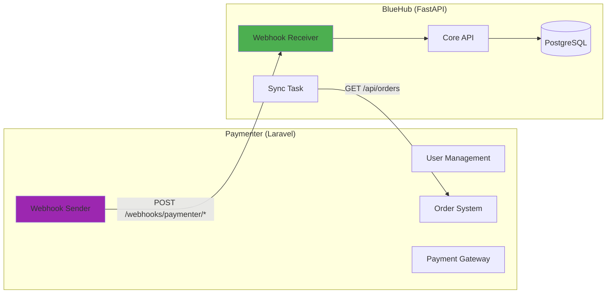

### 6.2 Webhook Event Types

| Event | Trigger | BlueHub Action |
|-------|---------|----------------|
| `user.created` | New user registers in Paymenter | Create local user with `paymenter_user_id` |
| `user.updated` | User updates profile | Sync email, name changes |
| `payment.succeeded` | Payment completed | Create service, queue provisioning |
| `payment.refunded` | Payment refunded | Suspend service, log audit |
| `subscription.renewed` | Auto-renewal succeeded | Extend service expiration |
| `subscription.cancelled` | User cancels subscription | Mark service for expiration |

### 6.3 Webhook Security

**Signature Verification:**
```python
import hmac
import hashlib

def verify_paymenter_webhook(payload: bytes, signature: str, secret: str) -> bool:
    expected = hmac.new(
        secret.encode(),
        payload,
        hashlib.sha256
    ).hexdigest()
    return hmac.compare_digest(expected, signature)
```

**Implementation in FastAPI:**
```python
@app.post("/webhooks/paymenter/{event_type}")
async def paymenter_webhook(
    event_type: str,
    request: Request,
    x_paymenter_signature: str = Header(...)
):
    payload = await request.body()
    if not verify_paymenter_webhook(payload, x_paymenter_signature, settings.PAYMENTER_SECRET):
        raise HTTPException(403, "Invalid signature")
    
    # Process webhook...
```

### 6.4 Sync Task (Fallback)

**Purpose:** Handle missed webhooks or network failures


**Celery Beat Schedule:**
```python
from celery.schedules import crontab

app.conf.beat_schedule = {
    'sync-paymenter-orders': {
        'task': 'tasks.sync_paymenter_orders',
        'schedule': crontab(minute='*/5'),  # Every 5 minutes
    },
}
```

**Task Implementation:**
```python
@celery_app.task
def sync_paymenter_orders():
    # Fetch orders from Paymenter API where status=paid and provisioned=false
    paid_orders = paymenter_client.get_unpaid_orders()
    
    for order in paid_orders:
        if not Order.exists(paymenter_order_id=order.id):
            # Create missing order
            create_service_from_order(order)
```

---

## 7. Module Registry & Feature Flags

### 7.1 Module Registry Architecture

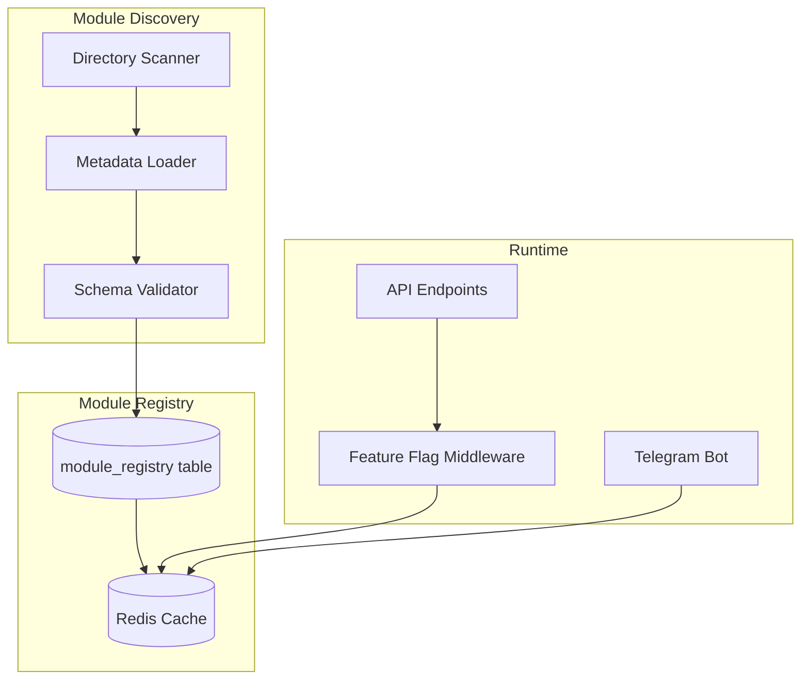

### 7.2 Module Metadata Structure

**File:** `modules/vpn/metadata.py`
```python
from shared.models import ModuleMetadata

METADATA = ModuleMetadata(
    name="vpn",
    display_name={
        "en": "VPN Service",
        "fa": "سرویس VPN",
    },
    description={
        "en": "Secure VPN with multiple protocols",
        "fa": "VPN امن با پروتکل‌های متنوع",
    },
    icon="shield",
    version="1.0.0",
    dependencies=[],
    
    # UI Configuration
    bot_keyboard={
        "text": {"en": "🛡 VPN", "fa": "🛡 وی‌پی‌ان"},
        "callback_data": "module:vpn",
    },
    
    admin_menu={
        "label": {"en": "VPN Management", "fa": "مدیریت VPN"},
        "route": "/admin/modules/vpn",
    },
    
    # Default Configuration
    default_config={
        "max_services_per_user": 5,
        "default_protocol": "wireguard",
        "traffic_polling_interval": 300,
    }
)
```

### 7.3 Module Registration Process

**Startup Registration:**
```python
# core/registry/loader.py

import importlib
from pathlib import Path

def discover_modules():
    modules_dir = Path("modules")
    discovered = []
    
    for module_path in modules_dir.iterdir():
        if module_path.is_dir() and (module_path / "metadata.py").exists():
            # Import metadata
            spec = importlib.util.spec_from_file_location(
                f"modules.{module_path.name}.metadata",
                module_path / "metadata.py"
            )
            module = importlib.util.module_from_spec(spec)
            spec.loader.exec_module(module)
            
            discovered.append(module.METADATA)
    
    return discovered

def register_modules(db_session):
    for metadata in discover_modules():
        # Upsert to database
        module = db_session.query(ModuleRegistry).filter_by(name=metadata.name).first()
        if not module:
            module = ModuleRegistry(
                name=metadata.name,
                enabled=True,  # Default enabled
                config=metadata.default_config,
                order=metadata.order or 999
            )
            db_session.add(module)
        
        # Update cache
        redis_client.setex(
            f"module:{metadata.name}:enabled",
            60,
            "true" if module.enabled else "false"
        )
        
        redis_client.setex(
            f"module:{metadata.name}:metadata",
            3600,
            metadata.model_dump_json()
        )
```

### 7.4 Feature Flag Middleware

```python
# api/v1/dependencies.py

from fastapi import Request, HTTPException
from core.registry import is_module_enabled

async def check_module_enabled(request: Request):
    """Middleware to check if module is enabled"""
    path = request.url.path
    
    # Extract module name from path: /v1/modules/vpn/...
    if "/modules/" in path:
        module_name = path.split("/modules/")[1].split("/")[0]
        
        if not await is_module_enabled(module_name):
            raise HTTPException(
                status_code=403,
                detail={
                    "error": "module_disabled",
                    "message": get_localized_message(
                        "errors.module_disabled",
                        request.state.language
                    )
                }
            )
```

### 7.5 Disable Modes

**Mode 1: Stop New Sales Only (Default)**
```python
# Only block purchase endpoints
BLOCKED_ENDPOINTS_STOP_SALES = [
    "/v1/modules/{module}/products",
    "/v1/modules/{module}/purchase",
]

# Allow service management endpoints
ALLOWED_ENDPOINTS_STOP_SALES = [
    "/v1/modules/{module}/services",
    "/v1/modules/{module}/services/{id}/config",
    "/v1/modules/{module}/services/{id}/usage",
]
```

**Mode 2: Terminate Active Services**
```python
@celery_app.task
def terminate_module_services(module_name: str):
    """Suspend all active services for a module"""
    services = Service.query.filter_by(
        module_name=module_name,
        status="active"
    ).all()
    
    for service in services:
        service.status = "suspended"
        service.suspended_at = datetime.utcnow()
        service.suspension_reason = f"Module {module_name} disabled by administrator"
        
        # Send notification
        send_notification(
            user_id=service.user_id,
            type="service_suspended",
            data={
                "service_id": service.id,
                "reason": service.suspension_reason
            }
        )
    
    db.session.commit()
```

---

## 8. Internationalization (i18n)

### 8.1 i18n Architecture

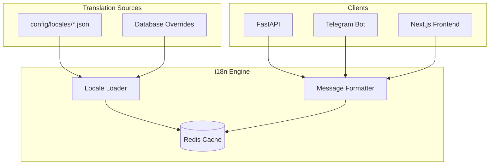

### 8.2 Translation File Structure

**File:** `config/locales/fa.json`
```json
{
  "common": {
    "welcome": "خوش آمدید",
    "error": "خطا",
    "success": "موفقیت‌آمیز",
    "loading": "در حال بارگذاری..."
  },
  
  "auth": {
    "login": "ورود",
    "register": "ثبت‌نام",
    "logout": "خروج",
    "password": "رمز عبور",
    "email": "ایمیل"
  },
  
  "modules": {
    "vpn": {
      "name": "سرویس VPN",
      "description": "VPN امن با پروتکل‌های متنوع",
      "purchase": "خرید VPN",
      "my_services": "سرویس‌های من",
      "config_download": "دریافت فایل پیکربندی"
    },
    
    "vps": {
      "name": "سرور مجازی",
      "description": "سرور مجازی اختصاصی",
      "create": "ساخت VPS"
    }
  },
  
  "errors": {
    "module_disabled": "این ماژول موقتاً غیرفعال است",
    "insufficient_balance": "موجودی کافی نیست",
    "invalid_credentials": "ایمیل یا رمز عبور اشتباه است",
    "service_not_found": "سرویس یافت نشد"
  },
  
  "notifications": {
    "service_activated": "سرویس شما فعال شد",
    "service_expires_soon": "سرویس شما {days} روز دیگر منقضی می‌شود",
    "payment_received": "پرداخت شما دریافت شد"
  }
}
```

**File:** `config/locales/en.json`
```json
{
  "common": {
    "welcome": "Welcome",
    "error": "Error",
    "success": "Success",
    "loading": "Loading..."
  },
  
  "auth": {
    "login": "Login",
    "register": "Register",
    "logout": "Logout",
    "password": "Password",
    "email": "Email"
  },
  
  "modules": {
    "vpn": {
      "name": "VPN Service",
      "description": "Secure VPN with multiple protocols",
      "purchase": "Purchase VPN",
      "my_services": "My Services",
      "config_download": "Download Configuration"
    }
  },
  
  "errors": {
    "module_disabled": "This module is temporarily unavailable",
    "insufficient_balance": "Insufficient balance",
    "invalid_credentials": "Invalid email or password",
    "service_not_found": "Service not found"
  },
  
  "notifications": {
    "service_activated": "Your service has been activated",
    "service_expires_soon": "Your service expires in {days} days",
    "payment_received": "Your payment has been received"
  }
}
```

### 8.3 i18n Implementation

**Core i18n Engine:**
```python
# core/i18n/engine.py

import json
from pathlib import Path
from typing import Dict, Any

class I18nEngine:
    def __init__(self, locales_dir: Path):
        self.locales_dir = locales_dir
        self.translations: Dict[str, Dict] = {}
        self.default_locale = "en"
        
    def load_locale(self, locale_code: str):
        """Load translations from JSON file"""
        file_path = self.locales_dir / f"{locale_code}.json"
        if file_path.exists():
            with open(file_path, 'r', encoding='utf-8') as f:
                self.translations[locale_code] = json.load(f)
    
    def get(self, key: str, locale: str = "en", **kwargs) -> str:
        """Get translated message with variable substitution"""
        if locale not in self.translations:
            self.load_locale(locale)
        
        # Navigate nested keys: "errors.module_disabled"
        keys = key.split(".")
        value = self.translations.get(locale, {})
        
        for k in keys:
            if isinstance(value, dict):
                value = value.get(k)
            else:
                break
        
        # Fallback to English
        if value is None:
            value = self._get_from_locale(key, self.default_locale)
        
        # Variable substitution: "expires in {days} days"
        if isinstance(value, str) and kwargs:
            value = value.format(**kwargs)
        
        return value or key
    
    def _get_from_locale(self, key: str, locale: str):
        keys = key.split(".")
        value = self.translations.get(locale, {})
        for k in keys:
            if isinstance(value, dict):
                value = value.get(k)
            else:
                return None
        return value

# Global instance
i18n = I18nEngine(Path("config/locales"))
```

**FastAPI Middleware:**
```python
# api/middleware/i18n.py

from fastapi import Request
from core.i18n import i18n

@app.middleware("http")
async def i18n_middleware(request: Request, call_next):
    # Extract language from header or user preference
    lang = request.headers.get("Accept-Language", "en").split(",")[0].split("-")[0]
    
    # If authenticated, use user's saved preference
    if hasattr(request.state, "user") and request.state.user:
        lang = request.state.user.language_code or lang
    
    request.state.language = lang
    request.state.t = lambda key, **kwargs: i18n.get(key, lang, **kwargs)
    
    response = await call_next(request)
    return response
```

**Telegram Bot Middleware:**
```python
# bot/middleware/i18n.py

from aiogram import BaseMiddleware
from aiogram.types import Update

class I18nMiddleware(BaseMiddleware):
    async def __call__(self, handler, event: Update, data: dict):
        # Detect language from Telegram user
        user = event.from_user
        lang = user.language_code or "en"
        
        # Override with saved preference from database
        db_user = await get_user_by_telegram_id(user.id)
        if db_user and db_user.language_code:
            lang = db_user.language_code
        
        data["lang"] = lang
        data["t"] = lambda key, **kwargs: i18n.get(key, lang, **kwargs)
        
        return await handler(event, data)
```

**Usage in API Endpoint:**
```python
@app.get("/v1/modules")
async def list_modules(request: Request):
    t = request.state.t
    
    modules = get_enabled_modules()
    return {
        "modules": [
            {
                "name": m.name,
                "display_name": t(f"modules.{m.name}.name"),
                "description": t(f"modules.{m.name}.description"),
            }
            for m in modules
        ]
    }
```

**Usage in Telegram Bot:**
```python
from bot.keyboards import get_main_keyboard

@router.message(Command("start"))
async def start_handler(message: Message, t):
    await message.answer(
        t("common.welcome"),
        reply_markup=get_main_keyboard(lang=message.from_user.language_code)
    )
```

### 8.4 Dynamic Translations in Admin Panel

**Add New Language Flow:**
1. Admin uploads `config/locales/de.json` via admin panel
2. System validates JSON structure
3. File is saved to disk
4. Redis cache is invalidated
5. i18n engine reloads on next request

**Translation Override:**
- Admins can override specific keys in database (`translation_overrides` table)
- Database overrides take precedence over file-based translations
- Used for A/B testing or urgent message changes

---

## 9. Security Architecture

### 9.1 Authentication Flow

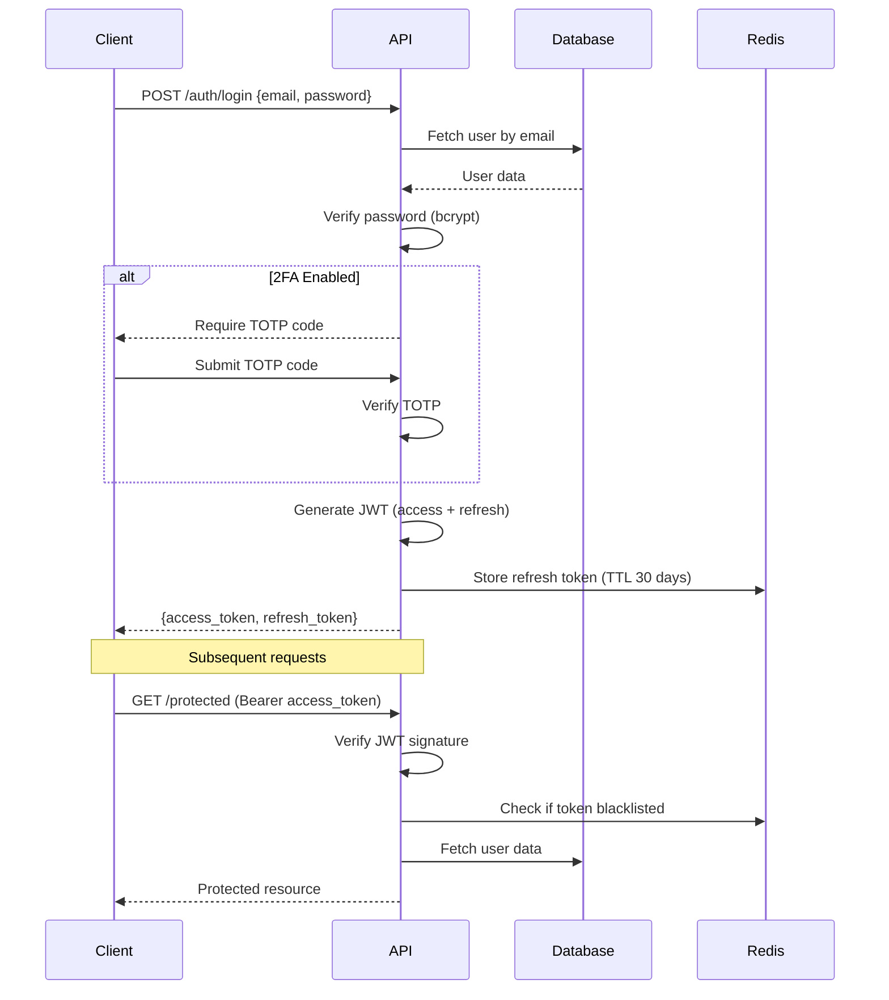

### 9.2 JWT Token Structure

**Access Token:**
```json
{
  "sub": "user_uuid",
  "tenant_id": "tenant_uuid",
  "role": "user",
  "exp": 1686400000,
  "iat": 1686396400,
  "jti": "unique_token_id"
}
```

**Refresh Token:**
```json
{
  "sub": "user_uuid",
  "type": "refresh",
  "exp": 1689088400,
  "jti": "unique_refresh_id"
}
```

**Token Configuration:**
- Access Token TTL: 1 hour
- Refresh Token TTL: 30 days
- Algorithm: RS256 (RSA with SHA-256)
- Key Rotation: Every 90 days

### 9.3 RBAC Implementation

**Permission Matrix:**

| Endpoint | User | Reseller | Admin | Superadmin |
|----------|------|----------|-------|------------|
| GET /v1/modules | ✓ | ✓ | ✓ | ✓ |
| POST /v1/modules/vpn/purchase | ✓ | ✓ | ✓ | ✓ |
| GET /v1/admin/modules | ✗ | ✗ | ✗ | ✓ |
| PATCH /v1/admin/modules/{id} | ✗ | ✗ | ✗ | ✓ |
| GET /v1/admin/tenants | ✗ | ✗ | ✗ | ✓ |
| GET /v1/admin/users (own tenant) | ✗ | ✗ | ✓ | ✓ |
| POST /v1/admin/suspend-service | ✗ | ✗ | ✓ | ✓ |

**Decorator Implementation:**
```python
from functools import wraps
from fastapi import HTTPException, Depends

def require_role(*allowed_roles):
    def decorator(func):
        @wraps(func)
        async def wrapper(*args, current_user=Depends(get_current_user), **kwargs):
            if current_user.role not in allowed_roles:
                raise HTTPException(403, "Insufficient permissions")
            return await func(*args, current_user=current_user, **kwargs)
        return wrapper
    return decorator

# Usage
@app.get("/v1/admin/modules")
@require_role("superadmin")
async def list_modules_admin(current_user: User):
    ...
```

### 9.4 Audit Logging

**Audit Events:**
- User login/logout
- Service creation/suspension/deletion
- Module enable/disable
- Tenant creation/modification
- Payment received
- Abuse detected
- Failed authentication attempts

**Audit Log Structure:**
```python
class AuditLog(Base):
    __tablename__ = "audit_logs"
    
    id = Column(UUID, primary_key=True)
    user_id = Column(UUID, ForeignKey("users.id"), nullable=True)
    tenant_id = Column(UUID, ForeignKey("tenants.id"))
    action = Column(String(100))  # "user.login", "service.create", "module.disable"
    resource_type = Column(String(50))  # "user", "service", "module"
    resource_id = Column(UUID, nullable=True)
    metadata = Column(JSONB)  # Additional context
    ip_address = Column(String(45))
    user_agent = Column(Text)
    created_at = Column(DateTime, default=datetime.utcnow)
```

**Usage:**
```python
def log_audit(action: str, user_id: UUID, resource_type: str, resource_id: UUID, metadata: dict, request: Request):
    log = AuditLog(
        user_id=user_id,
        tenant_id=request.state.tenant_id,
        action=action,
        resource_type=resource_type,
        resource_id=resource_id,
        metadata=metadata,
        ip_address=request.client.host,
        user_agent=request.headers.get("User-Agent")
    )
    db.session.add(log)
    db.session.commit()
```

---

## 10. Deployment Architecture

### 10.0 Critical Infrastructure Requirements

#### 10.0.1 Disaster Recovery (DR) Strategy

**RTO & RPO Targets:**
- **RTO (Recovery Time Objective):** 4 hours
- **RPO (Recovery Point Objective):** 1 hour
- **Availability Target:** 99.9% (43 minutes downtime/month)

**Multi-Region Backup Architecture:**

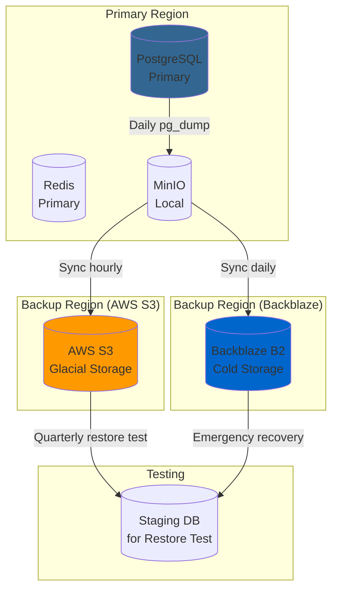

**Backup Strategy:**

```python
# services/tasks/backup.py

@celery_app.task(bind=True, max_retries=3)
def backup_database():
    """Daily database backup with geographic redundancy"""
    timestamp = datetime.utcnow().strftime("%Y%m%d_%H%M%S")
    
    # 1. Local backup to MinIO
    backup_file = backup_to_minio(timestamp)
    
    # 2. Hourly sync to AWS S3 (hot backup)
    sync_to_s3(backup_file, storage_class="STANDARD_IA")
    
    # 3. Daily sync to Backblaze B2 (cold backup)
    sync_to_backblaze(backup_file, storage_class="COLD")
    
    # 4. Update backup metadata
    update_backup_manifest(backup_file)
    
    # 5. Cleanup old backups (retain 30 days local, 90 days S3, 1 year B2)
    cleanup_old_backups(days_local=30, days_s3=90, days_b2=365)

@celery_app.on_after_finalize.connect
def setup_backup_schedule(sender, **kwargs):
    """Setup backup schedule"""
    sender.add_periodic_task(
        crontab(hour='*/1'),  # Every hour
        sync_backups_to_cloud.s(),
        name='sync-backups-to-cloud'
    )
    sender.add_periodic_task(
        crontab(hour=2, minute=0),  # Daily at 2 AM
        backup_database.s(),
        name='daily-backup'
    )

@celery_app.task
def quarterly_restore_test():
    """Quarterly backup restore testing (Disaster Recovery Drill)"""
    # Restore latest backup to staging PostgreSQL
    # Run smoke tests
    # Verify data integrity
    # Generate report
    logger.info("Quarterly DR drill completed successfully")
```

**Disaster Recovery Runbook:**

1. **RTO < 1 hour:** Failover to read replica (if partially corrupted)
2. **RTO < 4 hours:** Restore from last hourly backup in S3
3. **RTO < 24 hours:** Restore from daily backup in Backblaze B2
4. **Data Loss Acceptable:** Failover to last known-good backup

---

### 10.0.2 Rate Limiting & DDoS Protection

**Rate Limiting Strategy:**

```python
# api/middleware/rate_limit.py

from slowapi import Limiter
from slowapi.util import get_remote_address
from slowapi.errors import RateLimitExceeded

limiter = Limiter(
    key_func=get_remote_address,
    storage_uri="redis://redis:6379/1",
    default_limits=["200 per day", "50 per hour"]
)

# Per-endpoint rate limits
RATE_LIMITS = {
    "/v1/auth/login": "5 per minute",  # Brute force protection
    "/v1/auth/register": "3 per minute",  # Spam registration protection
    "/v1/modules/vpn/purchase": "10 per hour",  # Purchase limit
    "/v1/admin/modules": "100 per hour",  # Admin operations
    "/webhooks/paymenter/*": "1000 per hour",  # Webhooks need higher limit
}

# Global endpoint rate limit (fallback)
DEFAULT_RATE_LIMIT = "100 per minute"

@app.get("/v1/modules/vpn/products")
@limiter.limit("30 per minute")  # Per-endpoint override
async def list_vpn_products(request: Request):
    """List VPN products with rate limiting"""
    return {"products": [...]}

@app.exception_handler(RateLimitExceeded)
async def rate_limit_handler(request: Request, exc: RateLimitExceeded):
    """Handle rate limit exceeded"""
    return JSONResponse(
        status_code=429,
        content={
            "error": "rate_limit_exceeded",
            "message": "Too many requests. Please retry later.",
            "retry_after": exc.detail.split("called ")[1] if "called" in exc.detail else "60"
        },
        headers={"Retry-After": "60"}
    )

# IP whitelist for internal services
RATE_LIMIT_WHITELIST = [
    "127.0.0.1",  # Localhost
    "10.0.0.0/8",  # Internal network
]

# Per-user rate limit (authenticated endpoints)
@app.middleware("http")
async def user_rate_limit_middleware(request: Request, call_next):
    """Add user-based rate limiting"""
    if request.state.user:
        # Higher limits for premium users
        if request.state.user.role in ["admin", "superadmin"]:
            request.state.rate_limit_multiplier = 10
        else:
            request.state.rate_limit_multiplier = 1
    
    response = await call_next(request)
    return response
```

**DDoS Protection Layers:**

```yaml
# nginx.conf - Ingress Level
limit_req_zone $binary_remote_addr zone=general:10m rate=10r/s;
limit_req_zone $binary_remote_addr zone=api:10m rate=100r/s;
limit_conn_zone $binary_remote_addr zone=addr:10m;

server {
    listen 80;
    
    # Layer 1: IP-based rate limiting
    limit_req zone=general burst=20 nodelay;
    limit_conn addr 10;
    
    # Layer 2: Connection timeout
    keepalive_timeout 10s;
    client_body_timeout 10s;
    
    # Layer 3: Request size limit
    client_max_body_size 10M;
    
    location /v1/api/ {
        limit_req zone=api burst=50 nodelay;
        proxy_pass http://api:8000;
    }
}
```

---

### 10.0.3 Circuit Breaker Pattern

**Circuit Breaker for External Dependencies:**

```python
# core/circuit_breaker.py

from pybreaker import CircuitBreaker
import httpx

# Define circuit breakers for external services
paymenter_breaker = CircuitBreaker(
    fail_max=5,  # Open after 5 failures
    reset_timeout=60,  # Reset after 60s
    listeners=[
        CircuitBreakerListener()  # Log events
    ]
)

proxmox_breaker = CircuitBreaker(
    fail_max=3,
    reset_timeout=120,
)

maxmind_breaker = CircuitBreaker(
    fail_max=10,
    reset_timeout=30,
)

@paymenter_breaker
async def call_paymenter_api(endpoint: str, data: dict) -> dict:
    """Call Paymenter API with circuit breaker protection"""
    try:
        async with httpx.AsyncClient() as client:
            response = await client.post(
                f"{settings.PAYMENTER_API_URL}/{endpoint}",
                json=data,
                headers={"Authorization": f"Bearer {settings.PAYMENTER_API_KEY}"},
                timeout=5.0  # 5 second timeout
            )
            response.raise_for_status()
            return response.json()
    except httpx.TimeoutException:
        logger.error(f"Paymenter timeout: {endpoint}")
        raise CircuitBreakerException("Paymenter service timeout")
    except httpx.HTTPError as e:
        logger.error(f"Paymenter error: {e}")
        raise

# Fallback when circuit is open
async def create_service_fallback(order_data: dict):
    """Fallback when Paymenter is unavailable"""
    service = Service(
        user_id=order_data["user_id"],
        product_id=order_data["product_id"],
        status="pending_payment_verification",  # Manual verification needed
        metadata={"paymenter_down_at": datetime.utcnow()}
    )
    db.session.add(service)
    db.session.commit()
    
    # Alert admin
    send_telegram_alert(
        admin_group_id,
        f"⚠️ Paymenter unavailable. Manual verification needed for order {order_data['order_id']}"
    )
    
    return service

@app.post("/v1/modules/vpn/purchase")
async def purchase_vpn(request: Request, payload: VPNPurchaseRequest):
    """Purchase VPN with circuit breaker fallback"""
    try:
        order = await call_paymenter_api(
            "orders/create",
            {
                "user_id": request.state.user.paymenter_user_id,
                "product_id": payload.product_id,
                "amount": payload.amount,
            }
        )
        return {"payment_url": order["payment_url"]}
    
    except CircuitBreakerException:
        # Paymenter is down - use fallback
        logger.warning("Paymenter circuit open, using fallback")
        service = await create_service_fallback(payload.dict())
        
        return JSONResponse(
            status_code=503,
            content={
                "error": "payment_service_unavailable",
                "message": "Payment service temporarily unavailable. Please try again later.",
                "service_id": str(service.id)
            }
        )
```

---

### 10.0.4 Secret Management

**Secrets Architecture:**

```mermaid
graph TD
    subgraph "Development"
        DEV_ENV[.env (gitignored)]
    end
    
    subgraph "Production"
        K8S_SECRETS[Kubernetes Secrets]
        SEALED[Sealed Secrets<br/>Encryption Layer]
        VAULT[(HashiCorp Vault<br/>Optional)]
    end
    
    subgraph "Application"
        APP[FastAPI App]
    end
    
    DEV_ENV -->|local| APP
    K8S_SECRETS -->|mounted volume| SEALED
    SEALED -->|decrypted| APP
    VAULT -.->|optional| APP
    
    style K8S_SECRETS fill:#2196F3
    style SEALED fill:#FF9800
    style VAULT fill:#9C27B0
```

**Implementation:**

```python
# config/secrets.py

from pydantic_settings import BaseSettings
from pydantic import Field
import os

class Settings(BaseSettings):
    # Database
    DATABASE_URL: str = Field(..., description="PostgreSQL connection string")
    DATABASE_PASSWORD: str = Field(..., description="DB password (from secrets)")
    
    # Redis
    REDIS_URL: str = Field(..., description="Redis connection string")
    REDIS_PASSWORD: str = Field(default="", description="Redis password")
    
    # Authentication
    JWT_SECRET_KEY: str = Field(..., description="JWT signing secret (CRITICAL)")
    JWT_ALGORITHM: str = "RS256"
    
    # Paymenter
    PAYMENTER_API_KEY: str = Field(..., description="Paymenter API key")
    PAYMENTER_WEBHOOK_SECRET: str = Field(..., description="Webhook HMAC secret")
    
    # Proxmox
    PROXMOX_PASSWORD: str = Field(..., description="Proxmox admin password")
    PROXMOX_API_TOKEN: str = Field(..., description="Proxmox API token")
    
    # AWS (if using S3 backups)
    AWS_ACCESS_KEY_ID: str = Field(default="", description="AWS access key")
    AWS_SECRET_ACCESS_KEY: str = Field(default="", description="AWS secret key")
    
    # Telegram Bot
    TELEGRAM_BOT_TOKEN: str = Field(..., description="Telegram bot token")
    
    class Config:
        env_file = ".env"
        case_sensitive = True
        # Do NOT expose secrets in logs/error messages
        json_encoder_defaults = {
            str: lambda v: "***" if any(secret in str(v).lower() for secret in ["secret", "password", "token", "key"]) else v
        }

# Secret rotation schedule
@celery_app.task
def rotate_jwt_secrets():
    """Rotate JWT secrets every 90 days"""
    # Generate new key pair
    # Update Kubernetes secret
    # Invalidate old tokens
    # Alert admins
    pass

# K8s deployment: secrets managed by sealed-secrets
# kubectl create secret generic bluehub-secrets \
#   --from-literal=jwt-secret-key=$(openssl rand -base64 32) \
#   --from-literal=paymenter-api-key=$(echo $PAYMENTER_KEY) \
#   --dry-run=client -o yaml | kubeseal > sealed-secrets.yaml

# Never commit secrets to git
# .gitignore should have: .env, *.key, *.pem, sealed-*.yaml (consider encrypting)
```

---

### 10.0.5 Database Partitioning Strategy

**Time-Series Data Partitioning:**

```sql
-- Option A: TimescaleDB (Recommended)
-- Install extension
CREATE EXTENSION IF NOT EXISTS timescaledb CASCADE;

-- Convert vpn_sessions to hypertable (automatic partitioning by month)
SELECT create_hypertable(
    'vpn_sessions',
    'connected_at',
    if_not_exists => TRUE,
    chunk_time_interval => INTERVAL '1 month'
);

-- Create indexes for common queries
CREATE INDEX idx_vpn_sessions_account_connected 
ON vpn_sessions (vpn_account_id, connected_at DESC);

-- Compression for old data (>30 days)
ALTER TABLE vpn_sessions SET (
    timescaledb.compress,
    timescaledb.compress_orderby = 'connected_at DESC',
    timescaledb.compress_segmentby = 'vpn_account_id'
);

SELECT add_compression_policy('vpn_sessions', INTERVAL '30 days');

-- Similar for audit_logs
SELECT create_hypertable(
    'audit_logs',
    'created_at',
    if_not_exists => TRUE,
    chunk_time_interval => INTERVAL '1 month'
);

-- Option B: Manual Range Partitioning (if not using TimescaleDB)
CREATE TABLE vpn_sessions_2026_01 PARTITION OF vpn_sessions
    FOR VALUES FROM ('2026-01-01') TO ('2026-02-01');

CREATE TABLE vpn_sessions_2026_02 PARTITION OF vpn_sessions
    FOR VALUES FROM ('2026-02-01') TO ('2026-03-01');

-- Create partitions automatically with stored procedure
CREATE OR REPLACE FUNCTION create_monthly_partition()
RETURNS void AS $$
DECLARE
    v_table_name text := 'vpn_sessions';
    v_partition_name text;
    v_start_date date;
    v_end_date date;
BEGIN
    v_start_date := date_trunc('month', now())::date;
    v_end_date := v_start_date + interval '1 month';
    v_partition_name := v_table_name || '_' || to_char(v_start_date, 'YYYY_MM');
    
    EXECUTE format(
        'CREATE TABLE IF NOT EXISTS %I PARTITION OF %I FOR VALUES FROM (%L) TO (%L)',
        v_partition_name, v_table_name, v_start_date, v_end_date
    );
END;
$$ LANGUAGE plpgsql;

-- Schedule monthly partition creation
SELECT cron.schedule('create_vpn_sessions_partition', '0 0 1 * *', 'SELECT create_monthly_partition()');
```

**Partitioning Query Examples:**

```python
# services/queries.py

async def get_vpn_session_stats(vpn_account_id: UUID, days: int = 30):
    """
    Get VPN session statistics.
    With partitioning, PostgreSQL automatically prunes partitions.
    """
    query = """
    SELECT 
        COUNT(*) as total_sessions,
        SUM(bytes_sent + bytes_received) as total_bandwidth,
        AVG(EXTRACT(EPOCH FROM (disconnected_at - connected_at))) as avg_duration,
        MAX(connected_at) as last_session
    FROM vpn_sessions
    WHERE vpn_account_id = :vpn_account_id
        AND connected_at > now() - interval '1 day' * :days
    """
    
    result = await db.execute(
        query,
        {"vpn_account_id": str(vpn_account_id), "days": days}
    )
    return result.first()

async def cleanup_old_sessions():
    """
    Archive old sessions to cold storage (if not using TimescaleDB compression).
    With TimescaleDB, this happens automatically.
    """
    cutoff_date = datetime.utcnow() - timedelta(days=90)
    
    # Export old sessions to MinIO before deletion
    query = """
    SELECT * FROM vpn_sessions 
    WHERE connected_at < :cutoff_date
    """
    
    sessions = await db.execute(query, {"cutoff_date": cutoff_date})
    # Export to Parquet + upload to MinIO
    
    # Delete old sessions
    await db.execute(
        "DELETE FROM vpn_sessions WHERE connected_at < :cutoff_date",
        {"cutoff_date": cutoff_date}
    )
```

---

### 10.1 Development Environment (Docker Compose)

### 10.2 Production Architecture (Kubernetes)

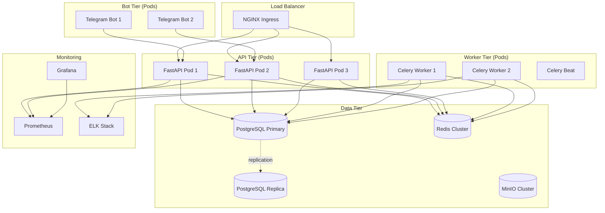

### 10.3 Scaling Strategy

**Horizontal Pod Autoscaling (HPA):**
```yaml
# k8s/hpa-api.yaml
apiVersion: autoscaling/v2
kind: HorizontalPodAutoscaler
metadata:
  name: bluehub-api
spec:
  scaleTargetRef:
    apiVersion: apps/v1
    kind: Deployment
    name: bluehub-api
  minReplicas: 3
  maxReplicas: 10
  metrics:
  - type: Resource
    resource:
      name: cpu
      target:
        type: Utilization
        averageUtilization: 70
  - type: Resource
    resource:
      name: memory
      target:
        type: Utilization
        averageUtilization: 80
```

**Database Scaling:**
- PostgreSQL: Primary-Replica setup with streaming replication
- Read queries → Replica (e.g., analytics, reports)
- Write queries → Primary
- Connection pooling: PgBouncer (max 100 connections per instance)

**Cache Scaling:**
- Redis Cluster: 3 master nodes + 3 replica nodes
- Consistent hashing for key distribution
- Automatic failover with Sentinel

**Object Storage:**
- MinIO distributed mode: 4 nodes with erasure coding (EC:2)
- 50% storage efficiency, tolerates 2 node failures

### 10.4 Backup Strategy

**Database Backups:**
```yaml
# Celery beat schedule
'backup-database': {
    'task': 'tasks.backup.backup_database',
    'schedule': crontab(hour=2, minute=0),  # Daily at 2 AM
}
```

**Implementation:**
```python
@celery_app.task
def backup_database():
    timestamp = datetime.utcnow().strftime("%Y%m%d_%H%M%S")
    backup_file = f"backup_bluehub_{timestamp}.sql.gz"
    
    # Use pg_dump
    subprocess.run([
        "pg_dump",
        "-h", settings.DB_HOST,
        "-U", settings.DB_USER,
        "-d", settings.DB_NAME,
        "-F", "c",  # Custom format
        "-f", f"/tmp/{backup_file}"
    ])
    
    # Compress and upload to MinIO
    with gzip.open(f"/tmp/{backup_file}.gz", 'wb') as f_out:
        with open(f"/tmp/{backup_file}", 'rb') as f_in:
            f_out.writelines(f_in)
    
    minio_client.fput_object(
        "backups",
        f"database/{backup_file}",
        f"/tmp/{backup_file}.gz"
    )
    
    # Cleanup
    os.remove(f"/tmp/{backup_file}")
    os.remove(f"/tmp/{backup_file}.gz")
    
    # Retain last 30 days
    cleanup_old_backups(days=30)
```

**Service Configuration Backups:**
- VPN configs, VPS snapshots → MinIO
- Retention: 7 days (rolling)
- Encryption: AES-256 before upload

### 10.5 Monitoring & Alerting

**Prometheus Metrics:**
```python
from prometheus_client import Counter, Histogram, Gauge

# Request metrics
http_requests_total = Counter(
    'bluehub_http_requests_total',
    'Total HTTP requests',
    ['method', 'endpoint', 'status']
)

# Latency metrics
http_request_duration_seconds = Histogram(
    'bluehub_http_request_duration_seconds',
    'HTTP request latency',
    ['method', 'endpoint']
)

# Business metrics
active_services_total = Gauge(
    'bluehub_active_services_total',
    'Total active services',
    ['module', 'tenant']
)

# Celery metrics
celery_task_duration = Histogram(
    'bluehub_celery_task_duration_seconds',
    'Celery task duration',
    ['task_name', 'status']
)
```

**Grafana Dashboards:**
1. **System Overview:** CPU, Memory, Disk, Network
2. **API Performance:** Request rate, latency (p50, p95, p99), error rate
3. **Business Metrics:** Active users, services per module, revenue
4. **Celery Queue:** Queue length, task success/failure rate, worker health
5. **Database:** Connection pool, query performance, replication lag

**Alerting Rules:**
```yaml
# prometheus/alerts.yml
groups:
- name: bluehub_alerts
  rules:
  - alert: HighErrorRate
    expr: rate(bluehub_http_requests_total{status=~"5.."}[5m]) > 0.05
    for: 5m
    annotations:
      summary: "High error rate detected"
      
  - alert: HighLatency
    expr: histogram_quantile(0.95, bluehub_http_request_duration_seconds) > 1
    for: 5m
    annotations:
      summary: "95th percentile latency > 1s"
      
  - alert: CeleryQueueBacklog
    expr: celery_queue_length > 1000
    for: 10m
    annotations:
      summary: "Celery queue has > 1000 pending tasks"
```

**Alert Destinations:**
- Critical: Telegram admin channel + PagerDuty
- Warning: Telegram admin channel
- Info: Slack channel

---

## 11. Technology Decision Log

| Decision | Options Considered | Choice | Rationale |
|----------|-------------------|--------|-----------|
| Backend Framework | Django, Flask, FastAPI | FastAPI | Async support, auto OpenAPI docs, Pydantic validation |
| Database | MySQL, PostgreSQL, MongoDB | PostgreSQL | JSONB for flexible schemas, strong ACID guarantees |
| Cache/Queue | RabbitMQ, Kafka, Redis | Redis | Simple, fast, supports both cache and Celery broker |
| Bot Framework | python-telegram-bot, aiogram | aiogram 3 | Modern async API, better performance |
| Frontend | Vue, React, Svelte | Next.js (React) | SSR, API routes, large ecosystem |
| UI Library | Material-UI, Ant Design, Shadcn | Shadcn | Customizable, Tailwind-based, lightweight |
| ORM | Raw SQL, SQLAlchemy, Tortoise | SQLAlchemy | Mature, flexible, good migration support |
| Deployment | Docker Swarm, K8s, Nomad | Kubernetes | Industry standard, extensive tooling |
| Monitoring | Datadog, New Relic, Self-hosted | Prometheus + Grafana | Cost-effective, full control |

---

## 12. Future Phases & Deferred Features

### 12.1 Phase 7: Advanced Features (Deferred)

The following features are intentionally deferred to Phase 7 or later based on business demand and maturity:

#### Anti-Crack System (DEFERRED)
- **Why Deferred:** No native mobile apps exist yet. Desktop obfuscation is premature.
- **When Needed:** After iOS/Android app launch in production.
- **Complexity:** High (ECDSA signatures, watermarking, obfuscation).
- **Estimated Effort:** 3-4 weeks research + implementation.

#### AI Adaptive Obfuscation (A²OE) (DEFERRED)
- **Why Deferred:** Research project, not MVP feature. Unproven ROI.
- **When Needed:** When DPI detection becomes a significant barrier.
- **Complexity:** Very High (ML model training, inference pipeline).
- **Estimated Effort:** 2-3 months (requires ML/Data Science team).

#### Hybrid P2P Relay Network (DEFERRED)
- **Why Deferred:** Complex infrastructure, legal liability concerns.
- **When Needed:** Only if centralized servers consistently blocked.
- **Complexity:** Very High (NAT traversal, peer selection, incentive system).
- **Estimated Effort:** 2-3 months + legal review.
- **Legal Risks:** DMCA, ISP terms of service violations.

#### Quantum-Resistant Encryption (DEFERRED)
- **Why Deferred:** NIST standards still finalizing. No immediate threat.
- **When Needed:** 2030+ when quantum computers mature.
- **Complexity:** High (Kyber, Dilithium integration).
- **Estimated Effort:** 4-6 weeks.

---

### 12.2 Open Questions for Product & Business

1. **Payment Gateways:** Which Paymenter integrations? (Stripe, PayPal, Crypto)
2. **Geographic Expansion:** Priority regions for VPN servers? (EU, APAC, Americas)
3. **Mobile Apps:** Native (Swift/Kotlin) or React Native? Timeline?
4. **Support SLA:** Response time for support tickets? (4h, 24h, Best effort)
5. **Abuse Thresholds:** Max concurrent connections? Max bandwidth per service?

---
منبع (برای استفاده و تغییرات  لازم برای خودمان  اوکی ):** https://github.com/arhamkhnz/next-shadcn-admin-dashboard

Built with Next.js 16, TypeScript, Tailwind CSS v4, and Shadcn UI
Responsive and mobile-friendly
Customizable theme presets (light/dark modes with color schemes like Tangerine, Brutalist, and more)
Flexible layouts (collapsible sidebar, variable content widths)
Authentication flows and screens
Prebuilt dashboards (Default, CRM, Finance, Analytics, Productivity) plus legacy variants
Role-Based Access Control (RBAC) with config-driven UI and multi-tenant support 

- Default Dashboard
- CRM Dashboard
- Finance Dashboard
Analytics Dashboard
Productivity Dashboard
E-commerce Dashboard
Academy Dashboard
Logistics Dashboard
Infrastructure Dashboard
Chat Page
Email Page
Users Management
Roles Management
Kanban Board
Tasks Page
Invoice Page
Calendar Page
Authentication (4 screens)
Legacy: Default v1, CRM v1, Finance v1, Analytics v1

---

*Document Version: 1.0*  
*Last Updated: 2026-06-10*  
*Total Diagrams: 7 (Mermaid)*  
*Total Database Tables: 15+*  
*Total API Endpoints: 20+ (documented)*

