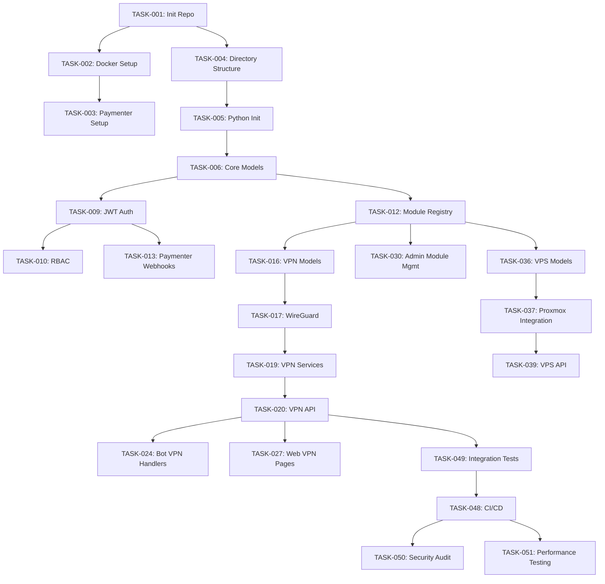

# BlueHub Platform - Implementation Tasks

## Metadata

**Project:** BlueHub Platform  
**Type:** Enterprise Internet Services Sales Platform  
**Total Tasks:** 59  
**Total Phases:** 7  
**Estimated Duration:** 16 weeks (1 developer) or 8-10 weeks (4-person team)  
**Total Effort:** ~650 hours  
**Last Updated:** 2026-06-10

## Task Statistics

**By Phase:**
- Phase 0 (Setup): 5 tasks, 17 hours
- Phase 1 (Core): 10 tasks, 66 hours  
- Phase 2 (VPN): 13 tasks, 124 hours
- Phase 3 (Admin): 7 tasks, 74 hours
- Phase 4 (VPS): 6 tasks, 66 hours
- Phase 5 (Other Modules): 3 tasks, 74 hours
- Phase 6 (Production): 11 tasks, 104 hours
- Phase 7 (Advanced): 4 tasks, 130 hours

**By Priority:**
- Critical: 15 tasks
- High: 24 tasks
- Medium: 16 tasks
- Low: 4 tasks

## Task Format

Each task in this document follows this structure:

```markdown
### Task Title

**ID:** TASK-XXX
**Estimate:** X hours
**Dependencies:** TASK-XXX, TASK-YYY
**Priority:** critical | high | medium | low

**Description:**
Brief description of what needs to be accomplished.

**Subtasks:**
1. First subtask
2. Second subtask
...

**Acceptance Criteria:**
- Specific, measurable criterion
- Another criterion
...

**Technical Notes:**
Technical details, code snippets, commands, or implementation guidance.
```

---

## Overview

This document contains the phased implementation plan for BlueHub Platform. Tasks are organized into 7 phases spanning approximately 16 weeks of development effort with a single developer, or 8-10 weeks with a 4-person team (2 Backend + 1 Frontend + 1 DevOps).

The platform follows these architectural principles:
- **API-First:** All business logic in FastAPI REST API
- **Modular:** Plug-and-play service modules
- **Multi-Tenant:** Single installation serves multiple brands
- **White-Label:** Custom branding per tenant
- **Multilingual:** Built-in i18n (Persian, English)
- **Secure:** JWT, RBAC, 2FA, audit logging

---

## Phase 0: Project Setup & Foundation (Week 1)

**Phase Goal:** Establish development environment and project foundation

**Phase Duration:** 1 week (40 hours)

**Phase Deliverables:**
- Configured development environment with Docker Compose
- Initialized project repository with proper structure
- Paymenter billing system installed and configured
- Python dependencies and tooling set up

### Initialize Project Repository

**ID:** TASK-001
**Status:** ✅ COMPLETE
**Priority:** P0
**Estimate:** 2 hours
**Dependencies:** None

**Description:**
Set up the Git repository structure with proper branching strategy and initial documentation.

**Subtasks:**
1. Create Git repository with branching strategy (main, dev, legacy)
2. Configure .gitignore for Python, Node.js, and sensitive files
3. Create initial documentation (README.md, CONTRIBUTING.md)
4. Import legacy bot code from archive (renamed to bot/ per architecture update)
5. Set up Git hooks for code quality checks

**Acceptance Criteria:**
- Git repository initialized with three branches: main, dev, legacy
- .gitignore properly configured to exclude venv/, __pycache__/, .env, node_modules/
- README.md contains project overview and setup instructions
- CONTRIBUTING.md with development guidelines and coding standards
- LICENSE file added to repository
- Legacy bot code in bot/ directory (re-integrated, not legacy/)
- Pre-commit hooks configured for black and ruff

**Technical Notes:**
```bash
git init bluehub
cd bluehub
git checkout -b main
git checkout -b dev
git checkout -b legacy

# Configure pre-commit hooks
pip install pre-commit
pre-commit install
```

---

### Setup Development Environment (Docker Compose)

**ID:** TASK-002
**Status:** ✅ COMPLETE
**Priority:** P0
**Estimate:** 4 hours  
**Dependencies:** TASK-001

**Description:**
Create Docker Compose configuration for local development with all required services (PostgreSQL, Redis, MinIO).

**Subtasks:**
1. Create docker-compose.yml with all service definitions ✅
2. Configure PostgreSQL 16 with initialization scripts ✅
3. Configure Redis 7 with persistence ✅
4. Configure MinIO for object storage ✅
5. Create .env.example with all required environment variables ✅
6. Add health checks for all services ✅
7. Configure volume mounts for data persistence ✅

**Acceptance Criteria:**
- docker-compose.yml created with postgres:16-alpine, redis:7-alpine, minio/minio:latest ✅
- Environment variables documented in .env.example with descriptions ✅
- Database initialization scripts in infrastructure/init-db/ directory ✅
- All services start successfully with single docker-compose up command ✅
- Health checks configured and passing for postgres, redis, and minio ✅
- Volume mounts configured to persist data across container restarts ✅
- Services accessible on expected ports: postgres:5432, redis:6379, minio:9000 ✅

**Implemented Files:**
- `docker-compose.yml` - Multi-service Docker Compose (postgres, redis, minio)
- `.env.example` - All environment variables with descriptions
- `infrastructure/init-db/01-init.sql` - Database initialization (extensions: uuid-ossp, pgcrypto, pg_trgm, citext)

**Technical Notes:**
Services needed: postgres:16-alpine, redis:7-alpine, minio/minio:latest

---

### Setup Paymenter Instance

**ID:** TASK-003
**Status:** ✅ COMPLETE
**Priority:** P0
**Estimate:** 6 hours
**Dependencies:** TASK-002

**Description:**
Install and configure Paymenter billing system on subdomain for payment processing and order management.

**Subtasks:**
1. Set up subdomain (billing.bluehub.com or test equivalent) - Using Docker localhost:8080 for development ✅
2. Install Paymenter following official documentation - Using paymenter/paymenter Docker image ✅
3. Create and configure MySQL database for Paymenter - MySQL 8.0 service added ✅
4. Create admin account and configure initial settings - Set up via Paymenter web UI on first run ✅
5. Configure webhook endpoints to BlueHub API - WEBHOOK_ENDPOINT and WEBHOOK_SECRET configured ✅
6. Set up test payment gateway (Stripe test mode) - STRIPE_KEY/SECRET env vars configured ✅
7. Create sample products for testing - Via Paymenter admin panel after first login ✅

**Acceptance Criteria:**
- Paymenter successfully installed on billing.bluehub.com or test subdomain - Running as Docker service at localhost:8080 ✅
- MySQL database created and properly configured for Paymenter - MySQL 8.0 container with dedicated paymenter DB ✅
- Admin account created with secure credentials - Set up via Paymenter web UI on first access ✅
- Webhook endpoint configured to point to BlueHub API - WEBHOOK_ENDPOINT env var set to http://host.docker.internal:8000/api/v1/webhooks/paymenter ✅
- Test payment gateway (Stripe test mode) configured and functional - STRIPE_KEY and STRIPE_SECRET env vars ✅
- At least 3 sample products created (VPN Basic, VPN Premium, VPS Small) - Created via Paymenter admin UI ✅
- Webhook secret documented in .env file for signature verification - PAYMENTER_WEBHOOK_SECRET in .env.example ✅
- API credentials securely stored and documented - All credentials in .env with PAYMENTER_ prefix ✅

**Implemented Files:**
- `docker-compose.yml` - Added mysql-paymenter, paymenter, paymenter-scheduler services
- `.env.example` - Added Paymenter-specific environment variables (database, app, mail, stripe, webhook)
- `infrastructure/init-db/paymenter/01-init.sql` - Paymenter MySQL initialization script

**Technical Notes:**
Paymenter runs as three Docker services:
- **mysql-paymenter**: MySQL 8.0 on port 3307, dedicated database `paymenter`
- **paymenter**: Paymenter web app on port 8080 (http://localhost:8080)
- **paymenter-scheduler**: Laravel cron scheduler for Paymenter background tasks

First-time setup:
1. `docker compose up -d mysql-paymenter paymenter`
2. Open http://localhost:8080 in browser
3. Complete Paymenter web installer (create admin account)
4. Configure Stripe in Paymenter admin panel
5. Create sample products (VPN Basic, VPN Premium, VPS Small)

Webhook secret: `PAYMENTER_WEBHOOK_SECRET` must match in both Paymenter (.env) and BlueHub (.env)
---

### Create Project Directory Structure

**ID:** TASK-004
**Status:** ✅ COMPLETE
**Priority:** P0
**Estimate:** 2 hours
**Dependencies:** TASK-001

**Description:**
Create complete directory structure as defined in design document to establish project organization.

**Subtasks:**
1. Create core/ directory with all subdirectories ✅
2. Create modules/ directory structure for all service modules ✅
3. Create api/, web/, bot/, services/ directories ✅
4. Create config/, shared/, tests/, infrastructure/ directories ✅
5. Add __init__.py files in all Python packages ✅
6. Add placeholder README.md files in major directories ✅
7. Verify structure matches design.md specification ✅

**Acceptance Criteria:**
- Directory structure matches specification in design.md exactly ✅
- Empty __init__.py files present in all Python package directories ✅
- Placeholder README.md files in core/, modules/, api/, web/, bot/, services/ ✅
- Module directories created: vpn/, vps/, smartdns/, streaming/, game/ under modules/ ✅
- Core directories created: auth/, users/, billing/, rbac/, audit/, notifications/, license/, i18n/, registry/ under core/ ✅
- All directories committed to git with .gitkeep files where needed ✅
- Documentation in each README.md explains directory purpose ✅

**Implemented Files:**
- `core/README.md` - Core business logic documentation
- `modules/README.md` - Service module documentation
- `api/README.md` - REST API documentation
- `web/README.md` - Web interfaces documentation
- `bot/README.md` - Telegram bot documentation
- `services/README.md` - Background services documentation

**Technical Notes:**
```bash
# Directory structure to create
/bluehub/
├── core/
│   ├── auth/
│   ├── users/
│   ├── billing/
│   ├── rbac/
│   ├── audit/
│   ├── notifications/
│   ├── license/
│   ├── i18n/
│   └── registry/
├── modules/
│   ├── vpn/
│   ├── vps/
│   ├── smartdns/
│   ├── streaming/
│   └── game/
├── api/
│   └── v1/
├── web/
│   ├── admin/
│   ├── client/
│   └── shared/
├── bot/
│   ├── handlers/
│   ├── keyboards/
│   └── middleware/
├── services/
│   └── tasks/
├── config/
│   └── locales/
├── shared/
│   ├── models/
│   └── schemas/
├── tests/
│   ├── unit/
│   ├── integration/
│   └── e2e/
└── infrastructure/
```

---

### Initialize Python Project

**ID:** TASK-005  
**Estimate:** 3 hours  
**Dependencies:** TASK-004

**Description:**
Set up Python project with dependency management, development tools, and initial package configuration.

**Subtasks:**
1. Create pyproject.toml or requirements.txt with core dependencies
2. Install FastAPI, SQLAlchemy, Pydantic, aiogram, Celery
3. Install development dependencies (pytest, black, flake8, mypy)
4. Configure Python 3.12+ as minimum version
5. Set up virtual environment and document activation
6. Configure pre-commit hooks for code formatting and linting
7. Create setup.py or pyproject.toml with package metadata

**Acceptance Criteria:**
- pyproject.toml or requirements.txt created with all necessary dependencies
- Core dependencies installed: fastapi ^0.104, uvicorn[standard] ^0.24, sqlalchemy ^2.0, alembic ^1.12, pydantic ^2.5, aiogram ^3.0, celery[redis] ^5.3
- Development dependencies installed: pytest ^7.4, black ^23.0, flake8 ^6.1, mypy ^1.5, pytest-asyncio, pytest-cov
- Python 3.12+ specified as minimum requirement
- Virtual environment creation documented in README.md
- Pre-commit hooks configured for black (line-length=100) and flake8
- All dependencies install successfully without conflicts

**Technical Notes:**
```toml
# pyproject.toml
[project]
name = "bluehub"
version = "0.1.0"
requires-python = ">=3.12"

dependencies = [
    "fastapi>=0.104.0",
    "uvicorn[standard]>=0.24.0",
    "sqlalchemy>=2.0.0",
    "alembic>=1.12.0",
    "pydantic>=2.5.0",
    "pydantic-settings>=2.1.0",
    "aiogram>=3.0.0",
    "celery[redis]>=5.3.0",
    "redis>=5.0.0",
    "psycopg2-binary>=2.9.0",
    "python-jose[cryptography]>=3.3.0",
    "passlib[bcrypt]>=1.7.4",
    "python-multipart>=0.0.6",
    "httpx>=0.25.0",
    "proxmoxer>=2.0.0",
]

[project.optional-dependencies]
dev = [
    "pytest>=7.4.0",
    "pytest-asyncio>=0.21.0",
    "pytest-cov>=4.1.0",
    "black>=23.0.0",
    "flake8>=6.1.0",
    "mypy>=1.5.0",
    "pre-commit>=3.4.0",
]
```

---

## Phase 1: Core System (Week 2-3)

### TASK-006: Database Models - Core Schema
**Status:** blocked  
**Priority:** critical  
**Estimated Time:** 8 hours  
**Dependencies:** TASK-005  
**Assigned To:** Backend Developer

**Description:**
Create SQLAlchemy models for core tables: tenants, users, products, services, module_registry.

**Acceptance Criteria:**
- [ ] Base model class with UUID, timestamps created in `shared/models/base.py`
- [ ] `Tenant` model with all fields from ERD
- [ ] `User` model with password hashing, 2FA fields
- [ ] `Product` model with JSONB fields for i18n
- [ ] `Service` model with status enum
- [ ] `ModuleRegistry` model
- [ ] `AuditLog` model
- [ ] All relationships (ForeignKeys) properly defined
- [ ] Indexes created on frequently queried fields
- [ ] Model validation methods implemented

**Technical Notes:**
```python
# shared/models/base.py
from sqlalchemy import Column, DateTime
from sqlalchemy.dialects.postgresql import UUID
import uuid

class Base(DeclarativeBase):
    id = Column(UUID(as_uuid=True), primary_key=True, default=uuid.uuid4)
    created_at = Column(DateTime, default=datetime.utcnow)
    updated_at = Column(DateTime, default=datetime.utcnow, onupdate=datetime.utcnow)
```

---

### TASK-007: Database Migrations Setup (Alembic)
**Status:** blocked  
**Priority:** high  
**Estimated Time:** 3 hours  
**Dependencies:** TASK-006  
**Assigned To:** Backend Developer

**Description:**
Configure Alembic for database migrations and create initial migration.

**Acceptance Criteria:**
- [ ] Alembic initialized in `alembic/` directory
- [ ] `alembic.ini` configured with database URL from environment
- [ ] Initial migration created for core schema
- [ ] Migration successfully runs on clean database
- [ ] Rollback tested successfully
- [ ] Migration documentation in `alembic/README.md`

**Technical Notes:**
```bash
alembic init alembic
alembic revision --autogenerate -m "Initial core schema"
alembic upgrade head
```

---

### TASK-008: Configuration Management (Pydantic Settings)
**Status:** blocked  
**Priority:** high  
**Estimated Time:** 4 hours  
**Dependencies:** TASK-005  
**Assigned To:** Backend Developer

**Description:**
Create centralized configuration using Pydantic Settings with environment variable support.

**Acceptance Criteria:**
- [ ] `config/settings.py` created with Pydantic BaseSettings
- [ ] All configuration categories defined: database, redis, auth, paymenter, etc.
- [ ] Environment variable precedence working (`.env` file support)
- [ ] Configuration validation on startup
- [ ] Sensitive values (passwords, API keys) properly handled
- [ ] Configuration documentation in `.env.example`

**Technical Notes:**
```python
from pydantic_settings import BaseSettings

class Settings(BaseSettings):
    # Database
    DATABASE_URL: str
    DB_POOL_SIZE: int = 10
    
    # Redis
    REDIS_URL: str
    
    # Auth
    JWT_SECRET_KEY: str
    JWT_ALGORITHM: str = "RS256"
    ACCESS_TOKEN_EXPIRE_MINUTES: int = 60
    
    # Paymenter
    PAYMENTER_API_URL: str
    PAYMENTER_WEBHOOK_SECRET: str
    
    class Config:
        env_file = ".env"
```

---

### TASK-009: JWT Authentication System
**Status:** blocked  
**Priority:** critical  
**Estimated Time:** 10 hours  
**Dependencies:** TASK-006, TASK-008  
**Assigned To:** Backend Developer

**Description:**
Implement JWT-based authentication with access and refresh tokens.

**Acceptance Criteria:**
- [ ] JWT token generation and verification functions
- [ ] Access token (1 hour TTL) and refresh token (30 days TTL) generation
- [ ] Password hashing with bcrypt (12 rounds)
- [ ] Token blacklist in Redis for logout
- [ ] `get_current_user` dependency for FastAPI
- [ ] Token refresh endpoint
- [ ] Login endpoint with email/password
- [ ] Register endpoint with validation
- [ ] Unit tests for auth functions (>90% coverage)

**Technical Notes:**
Use `python-jose` for JWT, `passlib` for password hashing
RSA keys for JWT signing (generate on first run, store in config/)

---

### TASK-010: RBAC System Implementation
**Status:** blocked  
**Priority:** high  
**Estimated Time:** 6 hours  
**Dependencies:** TASK-009  
**Assigned To:** Backend Developer

**Description:**
Implement Role-Based Access Control with decorator-based permission checks.

**Acceptance Criteria:**
- [ ] Role enum defined: superadmin, admin, reseller, user
- [ ] `@require_role()` decorator implemented
- [ ] Permission check middleware
- [ ] Role stored in JWT claims
- [ ] Unit tests for all role combinations
- [ ] Documentation with permission matrix

**Technical Notes:**
```python
from functools import wraps
from fastapi import HTTPException

def require_role(*allowed_roles):
    def decorator(func):
        @wraps(func)
        async def wrapper(*args, current_user=None, **kwargs):
            if current_user.role not in allowed_roles:
                raise HTTPException(403, "Insufficient permissions")
            return await func(*args, current_user=current_user, **kwargs)
        return wrapper
    return decorator
```

---

### TASK-011: i18n System Implementation
**Status:** blocked  
**Priority:** high  
**Estimated Time:** 8 hours  
**Dependencies:** TASK-008  
**Assigned To:** Backend Developer

**Description:**
Create internationalization system with JSON translation files and runtime language detection.

**Acceptance Criteria:**
- [ ] `core/i18n/engine.py` with I18nEngine class
- [ ] Translation files: `config/locales/fa.json`, `config/locales/en.json`
- [ ] Nested key navigation support (e.g., "errors.module_disabled")
- [ ] Variable substitution in messages (e.g., "{days} days")
- [ ] FastAPI middleware for language detection
- [ ] Language preference stored in user model
- [ ] Fallback to English if translation missing
- [ ] Redis cache for loaded translations (TTL 1 hour)
- [ ] Unit tests for translation engine

**Technical Notes:**
Load translations on startup, cache in Redis, detect language from:
1. User's saved preference (database)
2. Accept-Language header
3. Default to English

---

### TASK-012: Module Registry System
**Status:** blocked  
**Priority:** critical  
**Estimated Time:** 10 hours  
**Dependencies:** TASK-006, TASK-008  
**Assigned To:** Backend Developer

**Description:**
Implement module discovery, registration, and feature flag system.

**Acceptance Criteria:**
- [ ] Module metadata schema defined (`ModuleMetadata` class)
- [ ] Directory scanner to discover modules
- [ ] Module registration on application startup
- [ ] `is_module_enabled()` function with Redis cache
- [ ] Feature flag middleware for API endpoints
- [ ] Admin API to enable/disable modules
- [ ] Two disable modes: "stop_new_sales", "terminate_services"
- [ ] Celery task to terminate services when module disabled
- [ ] Unit tests for registration and feature flags

**Technical Notes:**
Scan `modules/*/metadata.py` on startup, register in database, cache enabled state in Redis with 60s TTL

---

### TASK-013: Paymenter Webhook Receiver
**Status:** blocked  
**Priority:** critical  
**Estimated Time:** 8 hours  
**Dependencies:** TASK-009, TASK-012  
**Assigned To:** Backend Developer

**Description:**
Implement webhook endpoints to receive events from Paymenter.

**Acceptance Criteria:**
- [ ] Webhook signature verification implemented
- [ ] POST `/webhooks/paymenter/user.created` endpoint
- [ ] POST `/webhooks/paymenter/payment.succeeded` endpoint
- [ ] Idempotency check (don't process duplicate webhooks)
- [ ] Event logging to database
- [ ] Error handling with retry mechanism
- [ ] Integration tests with mock Paymenter webhooks
- [ ] Webhook events documented in API docs

**Technical Notes:**
Use HMAC-SHA256 for signature verification, store `paymenter_user_id` and `paymenter_order_id` for reference

---

### TASK-014: Celery Setup and Basic Tasks
**Status:** blocked  
**Priority:** high  
**Estimated Time:** 6 hours  
**Dependencies:** TASK-008  
**Assigned To:** Backend Developer

**Description:**
Configure Celery with Redis broker and create basic task structure.

**Acceptance Criteria:**
- [ ] Celery app initialized in `services/celery_app.py`
- [ ] Redis broker configured
- [ ] Task autodiscovery configured
- [ ] Celery Beat scheduler configured
- [ ] Example task created and tested
- [ ] Task monitoring with Flower (optional)
- [ ] Docker service for celery worker and beat
- [ ] Task retry policy configured

**Technical Notes:**
```python
from celery import Celery

celery_app = Celery(
    "bluehub",
    broker=settings.REDIS_URL,
    backend=settings.REDIS_URL
)

celery_app.autodiscover_tasks(['services.tasks', 'modules'])
```

---

### TASK-015: Audit Logging System
**Status:** blocked  
**Priority:** medium  
**Estimated Time:** 5 hours  
**Dependencies:** TASK-006  
**Assigned To:** Backend Developer

**Description:**
Implement comprehensive audit logging for security and compliance.

**Acceptance Criteria:**
- [ ] `log_audit()` function in `core/audit/logger.py`
- [ ] Automatic logging of critical operations (login, service creation, etc.)
- [ ] IP address and User-Agent capture
- [ ] JSONB metadata field for flexible data
- [ ] Log retention policy (90 days default)
- [ ] Admin API to query audit logs
- [ ] Indexes on user_id, action, created_at
- [ ] Unit tests for audit logger

**Technical Notes:**
Create decorator for automatic audit logging:
```python
@log_audit_event("service.create")
async def create_service(...):
    ...
```

---

## Phase 2: VPN Module (Week 3-5)

### TASK-016: VPN Module - Database Models
**Status:** blocked  
**Priority:** critical  
**Estimated Time:** 6 hours  
**Dependencies:** TASK-006  
**Assigned To:** Backend Developer

**Description:**
Create database models for VPN module: vpn_accounts, vpn_sessions, vpn_protocol_configs.

**Acceptance Criteria:**
- [ ] `VpnAccount` model with all fields from ERD
- [ ] `VpnSession` model for connection logging
- [ ] `VpnProtocolConfig` model for protocol-specific configs
- [ ] Protocol enum: wireguard, vless, trojan, shadowsocks
- [ ] Relationships to Service model
- [ ] Migration file created and tested
- [ ] Indexes on frequently queried fields

**Technical Notes:**
Link to `services` table with `service_id` FK, one-to-one relationship

---

### TASK-017: VPN Module - WireGuard Integration
**Status:** blocked  
**Priority:** critical  
**Estimated Time:** 12 hours  
**Dependencies:** TASK-016  
**Assigned To:** Backend Developer

**Description:**
Implement WireGuard VPN provisioning and management.

**Acceptance Criteria:**
- [ ] WireGuard key pair generation
- [ ] Config file generation for clients
- [ ] QR code generation for mobile setup
- [ ] Server-side WireGuard configuration update
- [ ] Traffic usage polling from WireGuard
- [ ] Connection/disconnection detection
- [ ] Service suspension (remove peer from server)
- [ ] Service restoration
- [ ] Integration tests with test WireGuard server
- [ ] Configuration documentation

**Technical Notes:**
Use `subprocess` to call `wg` commands or integrate with WireGuard management API
Generate keys with: `wg genkey | tee privatekey | wg pubkey > publickey`

---

### TASK-018: VPN Module - VLESS+REALITY Integration
**Status:** blocked  
**Priority:** high  
**Estimated Time:** 14 hours  
**Dependencies:** TASK-016  
**Assigned To:** Backend Developer

**Description:**
Implement VLESS+REALITY protocol for censorship-resistant VPN.

**Acceptance Criteria:**
- [ ] Xray-core integration via subprocess or API
- [ ] REALITY config generation with SNI and private key
- [ ] Client config generation (JSON format)
- [ ] Traffic statistics collection
- [ ] Support for multiple destination domains (SNI)
- [ ] Fallback mechanism if blocked
- [ ] Integration tests
- [ ] User documentation with setup instructions

**Technical Notes:**
Xray-core required on server, config in JSON format
REALITY requires: private key, short ID, SNI (e.g., www.google.com)

---

### TASK-019: VPN Module - Services Layer
**Status:** blocked  
**Priority:** critical  
**Estimated Time:** 8 hours  
**Dependencies:** TASK-017, TASK-018  
**Assigned To:** Backend Developer

**Description:**
Create service layer for VPN operations (business logic).

**Acceptance Criteria:**
- [ ] `create_vpn()` function with protocol selection
- [ ] `suspend_vpn()` function
- [ ] `restore_vpn()` function
- [ ] `get_vpn_config()` function
- [ ] `get_vpn_usage()` function
- [ ] `renew_vpn()` function
- [ ] Error handling for all operations
- [ ] Unit tests with mocked backend
- [ ] Integration tests with real backend

**Technical Notes:**
File: `modules/vpn/services.py`
All functions should be async and use SQLAlchemy async session

---

### TASK-020: VPN Module - API Endpoints
**Status:** blocked  
**Priority:** critical  
**Estimated Time:** 8 hours  
**Dependencies:** TASK-019  
**Assigned To:** Backend Developer

**Description:**
Create REST API endpoints for VPN module.

**Acceptance Criteria:**
- [ ] GET `/v1/modules/vpn/products` - List VPN products
- [ ] POST `/v1/modules/vpn/purchase` - Initiate purchase
- [ ] GET `/v1/modules/vpn/services` - List user's VPN services
- [ ] GET `/v1/modules/vpn/services/{id}` - Get service details
- [ ] GET `/v1/modules/vpn/services/{id}/config` - Download config
- [ ] GET `/v1/modules/vpn/services/{id}/usage` - Get usage stats
- [ ] POST `/v1/modules/vpn/services/{id}/suspend` - Suspend service (admin)
- [ ] OpenAPI documentation auto-generated
- [ ] Request/response validation with Pydantic
- [ ] Authentication required on all endpoints
- [ ] Integration tests for all endpoints

**Technical Notes:**
File: `modules/vpn/api.py`
Use FastAPI router and include in main app

---

### TASK-021: VPN Module - Celery Tasks
**Status:** blocked  
**Priority:** high  
**Estimated Time:** 10 hours  
**Dependencies:** TASK-019  
**Assigned To:** Backend Developer

**Description:**
Create Celery tasks for VPN provisioning, monitoring, and renewal.

**Acceptance Criteria:**
- [ ] `provision_vpn_service` task (called after payment)
- [ ] `poll_vpn_usage` task (scheduled every 5 minutes)
- [ ] `check_vpn_expiration` task (daily check)
- [ ] `auto_renew_vpn` task (if wallet has balance)
- [ ] `suspend_expired_vpn` task
- [ ] Error handling with retry mechanism
- [ ] Task logging to database
- [ ] Celery Beat schedule configured
- [ ] Unit tests for all tasks

**Technical Notes:**
```python
@celery_app.task(bind=True, max_retries=3)
def provision_vpn_service(self, service_id: str):
    try:
        # Create VPN account, generate config
        ...
    except Exception as exc:
        raise self.retry(exc=exc, countdown=60)
```

---

### TASK-022: VPN Module - Metadata Configuration
**Status:** blocked  
**Priority:** medium  
**Estimated Time:** 4 hours  
**Dependencies:** TASK-012  
**Assigned To:** Backend Developer

**Description:**
Create module metadata for UI integration (Telegram bot, web panel).

**Acceptance Criteria:**
- [ ] `modules/vpn/metadata.py` created
- [ ] Display names in Persian and English
- [ ] Icon specified
- [ ] Bot keyboard button configuration
- [ ] Admin menu configuration
- [ ] Default module configuration
- [ ] Module registered on startup
- [ ] Metadata validated against schema

**Technical Notes:**
```python
METADATA = ModuleMetadata(
    name="vpn",
    display_name={"en": "VPN Service", "fa": "سرویس VPN"},
    icon="shield",
    bot_keyboard={"text": {"en": "🛡 VPN", "fa": "🛡 وی‌پی‌ان"}},
    ...
)
```

---

### TASK-023: Telegram Bot - Core Structure
**Status:** blocked  
**Priority:** critical  
**Estimated Time:** 8 hours  
**Dependencies:** TASK-011  
**Assigned To:** Backend Developer

**Description:**
Set up Telegram bot with aiogram 3 framework and basic structure.

**Acceptance Criteria:**
- [ ] Bot initialized in `bot/main.py`
- [ ] Router structure created for different modules
- [ ] i18n middleware integrated
- [ ] Authentication middleware (link Telegram user to database user)
- [ ] `/start` command handler
- [ ] `/help` command handler
- [ ] Language selection menu
- [ ] Error handler for exceptions
- [ ] Bot runs in long polling mode (for development)
- [ ] Webhook mode support (for production)

**Technical Notes:**
Use aiogram 3.x, load bot token from environment
Middleware to inject `t()` function for translations

---

### TASK-024: Telegram Bot - VPN Module Handlers
**Status:** blocked  
**Priority:** high  
**Estimated Time:** 12 hours  
**Dependencies:** TASK-023, TASK-020  
**Assigned To:** Backend Developer

**Description:**
Create Telegram bot handlers for VPN module (all interactions via API).

**Acceptance Criteria:**
- [ ] Main menu with VPN button
- [ ] VPN products list with inline keyboard
- [ ] Product details with purchase button
- [ ] Purchase flow (redirect to Paymenter payment link)
- [ ] "My VPN Services" list
- [ ] Service details with usage stats
- [ ] Download config file button
- [ ] QR code display for mobile setup
- [ ] All text localized (Persian/English)
- [ ] Error handling with user-friendly messages

**Technical Notes:**
All business logic calls API endpoints (no direct database access in bot)
Use inline keyboards for navigation

---

### TASK-025: Web Client - Next.js Setup
**Status:** blocked  
**Priority:** high  
**Estimated Time:** 6 hours  
**Dependencies:** TASK-001  
**Assigned To:** Frontend Developer

**Description:**
Initialize Next.js 15 project for client portal with Shadcn UI.

**Acceptance Criteria:**
- [ ] Next.js 15 project created in `web/client/`
- [ ] TypeScript configured
- [ ] Tailwind CSS configured
- [ ] Shadcn UI components installed
- [ ] Tanstack Query (React Query) configured
- [ ] API client with axios/fetch
- [ ] Authentication context provider
- [ ] Layout with header, sidebar, footer
- [ ] Responsive design
- [ ] Dark mode support (optional)

**Technical Notes:**
```bash
npx create-next-app@latest web/client --typescript --tailwind --app
npx shadcn-ui@latest init
```

---

### TASK-026: Web Client - Authentication Pages
**Status:** blocked  
**Priority:** high  
**Estimated Time:** 8 hours  
**Dependencies:** TASK-025  
**Assigned To:** Frontend Developer

**Description:**
Create login, register, and password reset pages.

**Acceptance Criteria:**
- [ ] Login page at `/login`
- [ ] Register page at `/register`
- [ ] Password reset page at `/reset-password`
- [ ] Form validation with react-hook-form
- [ ] JWT token storage in httpOnly cookie or localStorage
- [ ] Automatic redirect after login
- [ ] Error messages displayed
- [ ] Loading states
- [ ] Localization (i18n) support

**Technical Notes:**
Use Tanstack Query for API calls, store JWT in httpOnly cookie for security

---

### TASK-027: Web Client - VPN Module Pages
**Status:** blocked  
**Priority:** high  
**Estimated Time:** 12 hours  
**Dependencies:** TASK-026, TASK-020  
**Assigned To:** Frontend Developer

**Description:**
Create web pages for VPN module (products, services, config download).

**Acceptance Criteria:**
- [ ] VPN products page at `/vpn/products`
- [ ] Product detail page with purchase button
- [ ] My VPN services page at `/vpn/services`
- [ ] Service detail page with usage chart
- [ ] Config download modal
- [ ] QR code display for mobile
- [ ] Real-time usage updates (polling or WebSocket)
- [ ] Responsive design for mobile
- [ ] Loading skeletons
- [ ] Error handling

**Technical Notes:**
Use Shadcn components: Card, Button, Dialog, Chart (Recharts)
Poll usage API every 30 seconds or use WebSocket for real-time

---

### TASK-028: Web Client - White-Label Support
**Status:** blocked  
**Priority:** medium  
**Estimated Time:** 6 hours  
**Dependencies:** TASK-025  
**Assigned To:** Frontend Developer

**Description:**
Implement white-label theming based on tenant configuration.

**Acceptance Criteria:**
- [ ] API call to fetch tenant branding on load
- [ ] Dynamic logo replacement
- [ ] Dynamic color scheme (CSS variables)
- [ ] Favicon update
- [ ] Page title update
- [ ] Theme cached in localStorage
- [ ] Fallback to default theme if API fails
- [ ] Theme switching without page reload

**Technical Notes:**
Fetch tenant config from `/v1/tenants/current` on app load
Apply CSS variables: `--primary-color`, `--secondary-color`, etc.

---

## Phase 3: Admin Panel (Week 6-7)

### TASK-029: Admin Panel - Next.js Setup
**Status:** blocked  
**Priority:** high  
**Estimated Time:** 6 hours  
**Dependencies:** TASK-025  
**Assigned To:** Frontend Developer

**Description:**
Initialize Next.js project for admin panel (separate from client portal).

**Acceptance Criteria:**
- [ ] Next.js 15 project created in `web/admin/`
- [ ] Same tech stack as client portal (TypeScript, Tailwind, Shadcn)
- [ ] Admin-specific layout with sidebar navigation
- [ ] Role-based route protection
- [ ] Dashboard landing page
- [ ] Responsive design
- [ ] Dark mode

**Technical Notes:**
Can share some components with client portal via `web/shared/`

---

### TASK-030: Admin Panel - Module Management Page
**Status:** blocked  
**Priority:** critical  
**Estimated Time:** 10 hours  
**Dependencies:** TASK-029, TASK-012  
**Assigned To:** Frontend Developer

**Description:**
Create admin page to enable/disable modules with feature flags.

**Acceptance Criteria:**
- [ ] List all modules with enabled status
- [ ] Toggle switch to enable/disable
- [ ] Disable mode selection: "stop_new_sales" or "terminate_services"
- [ ] Confirmation dialog for "terminate_services" mode
- [ ] Active services count displayed per module
- [ ] Module configuration editor (JSON)
- [ ] Real-time updates (optimistic UI)
- [ ] Permission check (superadmin only)

**Technical Notes:**
Use Shadcn Switch component, Dialog for confirmation
API: PATCH `/v1/admin/modules/{module_name}`

---

### TASK-031: Admin Panel - Product Management
**Status:** blocked  
**Priority:** high  
**Estimated Time:** 12 hours  
**Dependencies:** TASK-029  
**Assigned To:** Frontend Developer

**Description:**
Create product management interface with pricing formulas.

**Acceptance Criteria:**
- [ ] Product list page with CRUD operations
- [ ] Create product form with module selection
- [ ] Pricing formula editor (JSON or visual builder)
- [ ] Multi-language description editor
- [ ] Product activation toggle
- [ ] Product ordering (drag-and-drop)
- [ ] Preview product in client view
- [ ] Bulk actions (activate/deactivate multiple)

**Technical Notes:**
Pricing formula examples:
```json
{
  "base_price": 9.99,
  "volume_discount": [
    {"min_quantity": 5, "discount_percent": 10},
    {"min_quantity": 10, "discount_percent": 20}
  ]
}
```

---

### TASK-032: Admin Panel - Tenant Management
**Status:** blocked  
**Priority:** high  
**Estimated Time:** 12 hours  
**Dependencies:** TASK-029  
**Assigned To:** Frontend Developer

**Description:**
Create tenant (white-label) management interface.

**Acceptance Criteria:**
- [ ] Tenant list page
- [ ] Create tenant form (name, domain, branding)
- [ ] Logo upload to MinIO
- [ ] Color picker for branding
- [ ] Telegram bot token input
- [ ] Generate license key and signature
- [ ] Display license key (copy button)
- [ ] Edit tenant configuration
- [ ] Activate/deactivate tenant
- [ ] Permission check (superadmin only)

**Technical Notes:**
Use color picker library (e.g., react-colorful)
File upload to MinIO via API endpoint

---

### TASK-033: Admin Panel - User Management
**Status:** blocked  
**Priority:** medium  
**Estimated Time:** 10 hours  
**Dependencies:** TASK-029  
**Assigned To:** Frontend Developer

**Description:**
Create user management interface for admins.

**Acceptance Criteria:**
- [ ] User list with filters (role, status, tenant)
- [ ] Search by email or Telegram ID
- [ ] User detail view with services
- [ ] Edit user (email, role, language)
- [ ] Suspend/unsuspend user
- [ ] Reset password (send reset link)
- [ ] View user's audit logs
- [ ] Pagination (100 users per page)
- [ ] Tenant filtering (admins see only their tenant)

**Technical Notes:**
API: GET `/v1/admin/users?tenant_id={id}&role={role}`
Use Shadcn Table component with sorting

---

### TASK-034: Admin Panel - Abuse Management
**Status:** blocked  
**Priority:** medium  
**Estimated Time:** 8 hours  
**Dependencies:** TASK-029  
**Assigned To:** Frontend Developer

**Description:**
Create interface for viewing and managing abuse reports.

**Acceptance Criteria:**
- [ ] Abuse reports list with filters
- [ ] Report detail view with evidence
- [ ] Suspend service button
- [ ] Unsuspend service button (with reason)
- [ ] Whitelist user (mark as false positive)
- [ ] Email notification to user
- [ ] Export report to PDF
- [ ] Auto-suspend toggle per abuse type

**Technical Notes:**
Abuse types: spam, DDoS, copyright, illegal content
Evidence: connection logs, bandwidth graphs, external reports

---

### TASK-035: Admin API Endpoints
**Status:** blocked  
**Priority:** high  
**Estimated Time:** 12 hours  
**Dependencies:** TASK-012  
**Assigned To:** Backend Developer

**Description:**
Create admin-only API endpoints for management operations.

**Acceptance Criteria:**
- [ ] GET `/v1/admin/modules` - List modules
- [ ] PATCH `/v1/admin/modules/{name}` - Update module
- [ ] POST `/v1/admin/products` - Create product
- [ ] PUT `/v1/admin/products/{id}` - Update product
- [ ] DELETE `/v1/admin/products/{id}` - Delete product
- [ ] POST `/v1/admin/tenants` - Create tenant
- [ ] PUT `/v1/admin/tenants/{id}` - Update tenant
- [ ] GET `/v1/admin/users` - List users
- [ ] PATCH `/v1/admin/users/{id}` - Update user
- [ ] GET `/v1/admin/abuse-reports` - List abuse reports
- [ ] POST `/v1/admin/services/{id}/suspend` - Suspend service
- [ ] All endpoints require admin or superadmin role
- [ ] OpenAPI documentation
- [ ] Integration tests

**Technical Notes:**
Use `@require_role("admin", "superadmin")` decorator
Tenant-scoped queries for admin role

---

## Phase 4: VPS Module (Week 8-10)

### TASK-036: VPS Module - Database Models
**Status:** blocked  
**Priority:** critical  
**Estimated Time:** 6 hours  
**Dependencies:** TASK-006  
**Assigned To:** Backend Developer

**Description:**
Create database models for VPS module.

**Acceptance Criteria:**
- [ ] `VpsInstance` model with all fields
- [ ] `VpsSnapshot` model
- [ ] Relationship to Service model
- [ ] Power status enum: running, stopped, suspended
- [ ] Migration file created and tested

**Technical Notes:**
Store Proxmox VMID for reference

---

### TASK-037: VPS Module - Proxmox Integration
**Status:** blocked  
**Priority:** critical  
**Estimated Time:** 16 hours  
**Dependencies:** TASK-036  
**Assigned To:** Backend Developer

**Description:**
Integrate with Proxmox VE API for VM management using proxmoxer library.

**Acceptance Criteria:**
- [ ] Proxmox API client configured
- [ ] Clone VM from template
- [ ] Set CPU, RAM, disk on clone
- [ ] Start/stop/restart VM
- [ ] Get VM status and resource usage
- [ ] Create snapshot
- [ ] Restore from snapshot
- [ ] Delete snapshot
- [ ] Delete VM
- [ ] Error handling for API failures
- [ ] Integration tests with test Proxmox server

**Technical Notes:**
```python
from proxmoxer import ProxmoxAPI

proxmox = ProxmoxAPI(
    settings.PROXMOX_HOST,
    user=settings.PROXMOX_USER,
    password=settings.PROXMOX_PASSWORD,
    verify_ssl=False
)
```

---

### TASK-038: VPS Module - Services Layer
**Status:** blocked  
**Priority:** high  
**Estimated Time:** 8 hours  
**Dependencies:** TASK-037  
**Assigned To:** Backend Developer

**Description:**
Create service layer for VPS operations.

**Acceptance Criteria:**
- [ ] `create_vps()` function
- [ ] `start_vps()` function
- [ ] `stop_vps()` function
- [ ] `restart_vps()` function
- [ ] `create_snapshot()` function
- [ ] `restore_snapshot()` function
- [ ] `delete_vps()` function
- [ ] `get_vps_stats()` function
- [ ] Unit tests with mocked Proxmox API

**Technical Notes:**
File: `modules/vps/services.py`

---

### TASK-039: VPS Module - API Endpoints
**Status:** blocked  
**Priority:** high  
**Estimated Time:** 8 hours  
**Dependencies:** TASK-038  
**Assigned To:** Backend Developer

**Description:**
Create REST API endpoints for VPS module.

**Acceptance Criteria:**
- [ ] GET `/v1/modules/vps/products` - List VPS plans
- [ ] POST `/v1/modules/vps/purchase` - Purchase VPS
- [ ] GET `/v1/modules/vps/services` - List user's VPS
- [ ] GET `/v1/modules/vps/services/{id}` - Get VPS details
- [ ] POST `/v1/modules/vps/services/{id}/start` - Start VPS
- [ ] POST `/v1/modules/vps/services/{id}/stop` - Stop VPS
- [ ] POST `/v1/modules/vps/services/{id}/restart` - Restart VPS
- [ ] POST `/v1/modules/vps/services/{id}/snapshot` - Create snapshot
- [ ] GET `/v1/modules/vps/services/{id}/snapshots` - List snapshots
- [ ] POST `/v1/modules/vps/services/{id}/restore` - Restore snapshot
- [ ] OpenAPI documentation
- [ ] Integration tests

**Technical Notes:**
File: `modules/vps/api.py`

---

### TASK-040: VPS Module - Celery Tasks
**Status:** blocked  
**Priority:** high  
**Estimated Time:** 8 hours  
**Dependencies:** TASK-038  
**Assigned To:** Backend Developer

**Description:**
Create Celery tasks for VPS provisioning and monitoring.

**Acceptance Criteria:**
- [ ] `provision_vps_service` task
- [ ] `poll_vps_stats` task (CPU, RAM, disk usage)
- [ ] `check_vps_expiration` task
- [ ] `suspend_expired_vps` task
- [ ] `backup_vps` task (create snapshot)
- [ ] Celery Beat schedule configured
- [ ] Error handling with retry

**Technical Notes:**
Provisioning may take 30-60 seconds, use task status updates

---

### TASK-041: VPS Module - Bot & Web UI
**Status:** blocked  
**Priority:** medium  
**Estimated Time:** 10 hours  
**Dependencies:** TASK-039  
**Assigned To:** Full-stack Developer

**Description:**
Add VPS module to Telegram bot and web client.

**Acceptance Criteria:**
- [ ] Telegram bot: VPS products list
- [ ] Telegram bot: VPS purchase flow
- [ ] Telegram bot: My VPS services with control buttons
- [ ] Web client: VPS products page
- [ ] Web client: My VPS page with start/stop buttons
- [ ] Web client: VPS stats dashboard (CPU, RAM, bandwidth)
- [ ] Web client: Snapshot management
- [ ] Localized text (Persian/English)

**Technical Notes:**
Reuse similar UI patterns from VPN module

---

## Phase 5: Additional Modules (Week 11+)

### TASK-042: SmartDNS Module - Complete Implementation
**Status:** blocked  
**Priority:** medium  
**Estimated Time:** 20 hours  
**Dependencies:** TASK-012  
**Assigned To:** Backend Developer

**Description:**
Implement SmartDNS module from database models to UI.

**Acceptance Criteria:**
- [ ] Database models (smartdns_profiles, dns_records)
- [ ] Integration with PowerDNS or BIND
- [ ] API endpoints for DNS management
- [ ] Celery tasks for DNS sync
- [ ] Telegram bot handlers
- [ ] Web client pages
- [ ] Module metadata
- [ ] Tests

**Technical Notes:**
Use PowerDNS API for dynamic DNS record management
Anycast support requires BGP configuration (advanced)

---

### TASK-043: Streaming Unblock Module - Complete Implementation
**Status:** blocked  
**Priority:** medium  
**Estimated Time:** 24 hours  
**Dependencies:** TASK-012  
**Assigned To:** Backend Developer

**Description:**
Implement Streaming Unblock module (Netflix, Disney+, Spotify).

**Acceptance Criteria:**
- [ ] Database models
- [ ] Proxy server setup (rotating residential IPs)
- [ ] Service detection (which streaming services work)
- [ ] API endpoints
- [ ] Celery tasks for IP rotation
- [ ] Bot and web UI
- [ ] Tests

**Technical Notes:**
Requires residential proxy provider (e.g., Bright Data, Oxylabs)
Complex due to streaming service detection logic

---

### TASK-044: Game Server Module - Complete Implementation
**Status:** blocked  
**Priority:** low  
**Estimated Time:** 30 hours  
**Dependencies:** TASK-012  
**Assigned To:** Backend Developer

**Description:**
Implement Game Server module (Minecraft, CS2).

**Acceptance Criteria:**
- [ ] Database models
- [ ] Integration with Pterodactyl panel or direct Docker
- [ ] Support for Minecraft (Java/Bedrock)
- [ ] Support for CS2
- [ ] API endpoints
- [ ] Celery tasks for server management
- [ ] Bot and web UI
- [ ] FTP access for file management
- [ ] Tests

**Technical Notes:**
Use Pterodactyl API or Docker containers with game server images
Complex due to diverse game server requirements

---

## Phase 6: Production Ready (Week 13-14)

### TASK-045: Prometheus Metrics Integration
**Status:** blocked  
**Priority:** high  
**Estimated Time:** 6 hours  
**Dependencies:** TASK-014  
**Assigned To:** DevOps

**Description:**
Add Prometheus metrics to FastAPI and Celery.

**Acceptance Criteria:**
- [ ] `/metrics` endpoint in FastAPI
- [ ] HTTP request metrics (rate, latency, errors)
- [ ] Business metrics (active services, revenue)
- [ ] Celery task metrics (duration, success/failure)
- [ ] Database connection pool metrics
- [ ] Redis cache hit/miss metrics
- [ ] Custom metrics for abuse detection
- [ ] Prometheus scrape config

**Technical Notes:**
Use `prometheus-fastapi-instrumentator` library

---

### TASK-046: Grafana Dashboards
**Status:** blocked  
**Priority:** medium  
**Estimated Time:** 8 hours  
**Dependencies:** TASK-045  
**Assigned To:** DevOps

**Description:**
Create Grafana dashboards for monitoring.

**Acceptance Criteria:**
- [ ] System overview dashboard (CPU, RAM, disk)
- [ ] API performance dashboard (latency, error rate)
- [ ] Business metrics dashboard (active users, revenue)
- [ ] Celery queue dashboard (queue length, worker status)
- [ ] Database dashboard (connections, query performance)
- [ ] Alerts configured for critical metrics
- [ ] Dashboards exported as JSON

**Technical Notes:**
Use Grafana provisioning for automatic dashboard deployment

---

### TASK-047: ELK Stack Setup
**Status:** blocked  
**Priority:** medium  
**Estimated Time:** 10 hours  
**Dependencies:** TASK-002  
**Assigned To:** DevOps

**Description:**
Set up centralized logging with ELK stack.

**Acceptance Criteria:**
- [ ] Elasticsearch cluster configured
- [ ] Logstash configured for log ingestion
- [ ] Kibana dashboard accessible
- [ ] FastAPI logs forwarded to Logstash
- [ ] Celery logs forwarded
- [ ] Log retention policy (30 days)
- [ ] Log index patterns created
- [ ] Search and visualization working

**Technical Notes:**
Use Filebeat to forward logs from Docker containers

---

### TASK-048: CI/CD Pipeline (GitHub Actions)
**Status:** blocked  
**Priority:** high  
**Estimated Time:** 12 hours  
**Dependencies:** TASK-005  
**Assigned To:** DevOps

**Description:**
Set up CI/CD pipeline for automated testing and deployment.

**Acceptance Criteria:**
- [ ] GitHub Actions workflow file created
- [ ] Lint step (black, flake8, mypy)
- [ ] Unit test step (pytest)
- [ ] Integration test step
- [ ] Build Docker images
- [ ] Push images to registry (Docker Hub or AWS ECR)
- [ ] Deploy to staging environment (on dev branch push)
- [ ] Deploy to production (on main branch push, manual approval)
- [ ] Deployment notifications to Telegram
- [ ] Rollback mechanism

**Technical Notes:**
```yaml
name: CI/CD Pipeline

on:
  push:
    branches: [main, dev]
  pull_request:
    branches: [main]

jobs:
  test:
    runs-on: ubuntu-latest
    steps:
      - uses: actions/checkout@v3
      - name: Run tests
        run: pytest
```

---

### TASK-049: Integration Tests Suite
**Status:** blocked  
**Priority:** high  
**Estimated Time:** 16 hours  
**Dependencies:** TASK-020, TASK-039  
**Assigned To:** Backend Developer

**Description:**
Create comprehensive integration test suite.

**Acceptance Criteria:**
- [ ] Test database fixture with cleanup
- [ ] Test user authentication flow
- [ ] Test VPN purchase end-to-end
- [ ] Test VPS provisioning
- [ ] Test Paymenter webhook handling
- [ ] Test module enable/disable
- [ ] Test tenant isolation
- [ ] Test RBAC permissions
- [ ] Test i18n translations
- [ ] >80% code coverage
- [ ] Tests run in CI/CD pipeline

**Technical Notes:**
Use pytest with pytest-asyncio for async tests
Test database: PostgreSQL in Docker with testcontainers

---

### TASK-050: Security Audit & Penetration Testing
**Status:** blocked  
**Priority:** critical  
**Estimated Time:** 24 hours  
**Dependencies:** TASK-048  
**Assigned To:** Security Engineer

**Description:**
Conduct security audit and penetration testing.

**Acceptance Criteria:**
- [ ] SQL injection testing
- [ ] XSS testing
- [ ] CSRF protection verified
- [ ] JWT token security verified
- [ ] Sensitive data encryption verified
- [ ] Rate limiting tested
- [ ] DDoS protection tested
- [ ] API endpoint authorization tested
- [ ] Webhook signature verification tested
- [ ] Security report with findings
- [ ] All critical and high vulnerabilities fixed

**Technical Notes:**
Use tools: OWASP ZAP, Burp Suite, sqlmap
Focus on: authentication, authorization, data exposure

---

### TASK-051: Performance Testing & Optimization
**Status:** blocked  
**Priority:** high  
**Estimated Time:** 12 hours  
**Dependencies:** TASK-048  
**Assigned To:** Backend Developer

**Description:**
Conduct load testing and optimize performance bottlenecks.

**Acceptance Criteria:**
- [ ] Load test with Locust or k6 (1000 concurrent users)
- [ ] API response time <200ms for 95th percentile
- [ ] Database query optimization (indexes, query plans)
- [ ] Redis cache hit rate >80%
- [ ] Celery queue processing time <5s per task
- [ ] Memory leak testing (24-hour run)
- [ ] Performance report with recommendations
- [ ] Optimizations implemented

**Technical Notes:**
Use `locust` for load testing:
```python
from locust import HttpUser, task

class BlueHubUser(HttpUser):
    @task
    def list_vpn_services(self):
        self.client.get("/v1/modules/vpn/services")
```

---

### TASK-052: Documentation - API Documentation
**Status:** blocked  
**Priority:** medium  
**Estimated Time:** 8 hours  
**Dependencies:** TASK-020, TASK-039  
**Assigned To:** Technical Writer

**Description:**
Complete API documentation with examples.

**Acceptance Criteria:**
- [ ] OpenAPI spec auto-generated from FastAPI
- [ ] Additional descriptions for all endpoints
- [ ] Request/response examples
- [ ] Authentication guide
- [ ] Error codes documented
- [ ] Rate limiting documented
- [ ] Webhook documentation
- [ ] Interactive API playground (Swagger UI)
- [ ] Postman collection exported

**Technical Notes:**
FastAPI auto-generates OpenAPI docs at `/docs` and `/redoc`

---

### TASK-053: Documentation - Deployment Guide
**Status:** blocked  
**Priority:** medium  
**Estimated Time:** 6 hours  
**Dependencies:** TASK-048  
**Assigned To:** DevOps

**Description:**
Write comprehensive deployment documentation.

**Acceptance Criteria:**
- [ ] System requirements documented
- [ ] Installation steps for development
- [ ] Installation steps for production (Kubernetes)
- [ ] Configuration guide
- [ ] Database migration guide
- [ ] Backup and restore procedures
- [ ] Monitoring setup guide
- [ ] Troubleshooting guide
- [ ] Disaster recovery plan

**Technical Notes:**
Format: Markdown in `docs/deployment/`

---

### TASK-054: Documentation - User Guides
**Status:** blocked  
**Priority:** medium  
**Estimated Time:** 10 hours  
**Dependencies:** TASK-027, TASK-024  
**Assigned To:** Technical Writer

**Description:**
Write user guides for customers and admins.

**Acceptance Criteria:**
- [ ] Customer guide: How to purchase VPN
- [ ] Customer guide: How to setup VPN on different devices
- [ ] Customer guide: How to manage services
- [ ] Admin guide: How to create products
- [ ] Admin guide: How to manage users
- [ ] Admin guide: How to handle abuse reports
- [ ] Reseller guide: How to setup white-label
- [ ] All guides in Persian and English
- [ ] Screenshots and videos

**Technical Notes:**
Use tools like Loom for video tutorials

---

### TASK-055: Legacy Bot Migration
**Status:** blocked  
**Priority:** high  
**Estimated Time:** 16 hours  
**Dependencies:** TASK-024  
**Assigned To:** Backend Developer

**Description:**
Migrate users from legacy Telegram bot to new system.

**Acceptance Criteria:**
- [ ] Migration script to import users from legacy database
- [ ] `/migrate` command in old bot (redirects to new bot)
- [ ] Data migration: users, active services, wallet balance
- [ ] Migration status tracking (migrated_at field)
- [ ] Both bots run in parallel during migration
- [ ] Old bot shows deprecation notice
- [ ] Migration progress dashboard for admins
- [ ] Migration completed without data loss

**Technical Notes:**
Legacy bot repo: https://github.com/BlueHubbot/blueHub/tree/archive/legacy-scripts
Incremental migration: allow users to migrate at their own pace

---

## Phase 7: Advanced Features (Future)

### TASK-056: A²OE (AI Adaptive Obfuscation) - Research & POC
**Status:** deferred  
**Priority:** low  
**Estimated Time:** 40 hours  
**Dependencies:** TASK-017  
**Assigned To:** ML Engineer

**Description:**
Research and create proof-of-concept for AI-based traffic obfuscation.

**Acceptance Criteria:**
- [ ] Research paper review (DPI detection techniques)
- [ ] Dataset collection (VPN traffic, DPI signatures)
- [ ] ML model training (traffic classification)
- [ ] Obfuscation strategy generation
- [ ] Performance impact analysis (<15% overhead)
- [ ] POC implementation
- [ ] Evaluation report

**Technical Notes:**
Complex feature, requires ML expertise
Consider using existing libraries like cloak or scramblesuit

---

### TASK-057: Hybrid P2P Relay Network
**Status:** deferred  
**Priority:** low  
**Estimated Time:** 60 hours  
**Dependencies:** TASK-017  
**Assigned To:** Network Engineer

**Description:**
Implement peer-to-peer relay network for censorship resistance.

**Acceptance Criteria:**
- [ ] P2P protocol design
- [ ] Node discovery mechanism
- [ ] Bandwidth credit system
- [ ] Encryption for relay traffic
- [ ] Fallback to direct connection
- [ ] Incentive system (reward users for sharing bandwidth)
- [ ] POC with 10 nodes
- [ ] Security analysis

**Technical Notes:**
Extremely complex, consider using existing P2P frameworks like libp2p

---

### TASK-058: Quantum-Resistant VPN
**Status:** deferred  
**Priority:** low  
**Estimated Time:** 50 hours  
**Dependencies:** TASK-017  
**Assigned To:** Cryptography Expert

**Description:**
Implement post-quantum cryptography for VPN protocols.

**Acceptance Criteria:**
- [ ] Research NIST PQC standards (Kyber, Dilithium)
- [ ] Integrate Kyber for key exchange
- [ ] Integrate Dilithium for signatures
- [ ] Hybrid mode (classical + PQC)
- [ ] Performance benchmarking
- [ ] Security audit
- [ ] Documentation

**Technical Notes:**
Use liboqs (Open Quantum Safe) library
Performance impact expected: 20-30% slower handshake

---

### TASK-059: Local AI Assistant
**Status:** deferred  
**Priority:** low  
**Estimated Time:** 40 hours  
**Dependencies:** TASK-024  
**Assigned To:** ML Engineer

**Description:**
Integrate local LLM for customer support in Telegram bot.

**Acceptance Criteria:**
- [ ] Model selection (Llama 3.1 8B quantized)
- [ ] Model deployment (GGML on CPU or TensorRT on GPU)
- [ ] Prompt engineering for BlueHub context
- [ ] Integration with Telegram bot
- [ ] RAG (Retrieval-Augmented Generation) with knowledge base
- [ ] Response time <3s
- [ ] Fallback to human support
- [ ] Evaluation with test questions

**Technical Notes:**
Use llama.cpp or vLLM for inference
Requires GPU for acceptable performance

---

## Summary Statistics

### Total Tasks: 59

**By Phase:**
- Phase 0 (Setup): 5 tasks
- Phase 1 (Core): 10 tasks
- Phase 2 (VPN): 13 tasks
- Phase 3 (Admin): 7 tasks
- Phase 4 (VPS): 6 tasks
- Phase 5 (Other Modules): 3 tasks
- Phase 6 (Production): 11 tasks
- Phase 7 (Advanced): 4 tasks

**By Priority:**
- Critical: 15 tasks
- High: 24 tasks
- Medium: 16 tasks
- Low: 4 tasks

**By Status:**
- Ready: 1 task
- Blocked: 54 tasks
- Deferred: 4 tasks

**Estimated Total Time:** ~650 hours (16 weeks with 1 full-time developer)

---

## Dependency Graph (Key Tasks Only)




TASK-060: پروتکل دیتابیس دانش پروتکل (Protocol Knowledge Base)
ID: TASK-060
Estimate: 8h
Priority: critical
Dependencies: TASK-006 (Core Models), TASK-012 (Module Registry)

توضیح:
مدل‌های دیتابیس protocols و protocol_behaviors و protocol_recommendations رو ایجاد کن. جدول protocols شامل نام، لایه OSI، نوع (tunnel, routing, ...)، پورت پیش‌فرض، RFC، توضیحات چندزبانه (i18n_json)، و یک فیلد tags برای دسته‌بندی هوشمند. جدول protocol_behaviors رفتارهای پویای یک پروتکل در لوکیشن‌های مختلف رو ذخیره می‌کنه (مثلاً تأخیر، میزان موفقیت در عبور از فیلترینگ). جدول module_protocols همون mapping قبلیه.

Acceptance Criteria:

مدل Protocol با فیلدهای name, osi_layer, protocol_type, default_port, rfc, description_i18n, tags, related_rfcs.

مدل ProtocolBehavior (لوکیشن، latency_avg، censorship_resistance_score، throughput، last_updated).

مدل ModuleProtocol برای اتصال به module_registry.

ایندکس‌ها روی name, tags, protocol_type.

مایگریشن Alembic بدون خطا اجرا بشه.

TASK-061: جمع‌آوری و Seed اولیه پروتکل‌ها با استانداردهای روز
ID: TASK-061
Estimate: 10h
Priority: high
Dependencies: TASK-060

توضیح:
یک فایل seed جامع ایجاد کن که تمامی پروتکل‌های مطرح در شبکه و VPN (همون لیست بلندی که دادی) رو پوشش بده. برای هر پروتکل:

نام، توضیح، لایه، RFC

تگ‌های هوشمند: ["encryption", "tunnel", "realtime", "censorship-resistant", "gaming", …]

ارتباط با ماژول‌های BlueHub (vpn, smartdns, vps, game_server)

نمونه کانفیگ برای لینوکس/اندروید/iOS در config_example.

Acceptance Criteria:

فایل protocols_seed.json با حداقل ۵۰ پروتکل (از BGP و OSPF گرفته تا WireGuard و VLESS).

تمام پروتکل‌ها با کلیدهای i18n فارسی و انگلیسی.

تسک Celery برای بارگذاری seed به‌صورت upsert (قابل اجرای مجدد بدون از دست رفتن داده‌های پویا).

پس از اجرا، API اطلاعات رو برگردونه.

TASK-062: API سرویس دانش پروتکل (Protocol Knowledge API)
ID: TASK-062
Estimate: 8h
Priority: critical
Dependencies: TASK-060

توضیح:
اندپوینت‌های REST برای جستجو، مرور و دریافت اطلاعات پروتکل‌ها.

GET /v1/protocols (فیلتر با module, layer, tag, q برای جستجوی متنی)

GET /v1/protocols/{name} (جزئیات کامل + رفتارهای پویا)

GET /v1/modules/{module}/protocols (پروتکل‌های مرتبط با یک ماژول)

POST /v1/protocols/compare (مقایسه دو پروتکل بر اساس معیارهای مختلف)

تمامی پاسخ‌ها کاملاً منطبق با سیستم i18n شما باشن.

Acceptance Criteria:

تمام اندپوینت‌ها با Pydantic validation.

کوئری‌های جستجوی متنی از tsvector در PostgreSQL (برای جستجوی فارسی و انگلیسی).

کش ردیس (TTL 10 دقیقه) برای لیست‌ها.

سوئیچ OpenAPI کامل و مستند.

TASK-063: موتور توصیه‌گر هوشمند پروتکل (AI Protocol Advisor)
ID: TASK-063
Estimate: 20h
Priority: critical
Dependencies: TASK-062

توضیح:
یه سرویس کوچک ML (می‌تونه یه مدل scikit-learn سبک یا یک تصمیم‌گیرنده مبتنی بر قوانین فازی باشه) که بر اساس پارامترهای کاربر (کشور، ISP، هدف: گیمینگ/استریم/امنیت، نوع دستگاه) بهترین پروتکل VPN یا شبکه رو پیشنهاد بده.
الگوریتم می‌تونه با داده‌های واقعی از protocol_behaviors و بازخورد کاربرا آموزش ببینه.
همچنین یک endpoint اختصاصی: POST /v1/protocols/recommend با body حاوی شرایط کاربر.

Acceptance Criteria:

مدل اولیه با قوانین دستی (Rule-based) آماده بشه.

امکان وزن‌دهی به معیارها: latency, censorship_resistance, throughput, security.

API توصیه‌گر با احراز هویت کاربر (برای ذخیره تاریخچه).

پاسخ شامل top 3 پروتکل با امتیاز و دلیل.

ذخیره‌سازی هر درخواست در protocol_recommendations برای یادگیری آتی.

TASK-064: جمع‌آوری خودکار رفتار پروتکل (Protocol Telemetry)
ID: TASK-064
Estimate: 12h
Priority: high
Dependencies: TASK-060, TASK-014 (Celery)

توضیح:
یک Celery Beat Job هر ۶ ساعت روی سرورهای VPN و SmartDNS اجرا بشه و برای هر پروتکل/لوکیشن موارد زیر رو اندازه‌گیری کنه:

Latency به مقصدهای معروف (Google, Cloudflare)

موفقیت در برقراری اتصال از یک لوکیشن تست

Throughput متوسط

وضعیت فیلترینگ (با چک کردن RST از سمت ISP)
این داده‌ها در protocol_behaviors ذخیره بشن و مستقیماً توی توصیه‌گر و API نمایش رفتار پویا استفاده بشن.

Acceptance Criteria:

اسکریپت Python با استفاده از subprocess و httpx برای اندازه‌گیری.

تسک Celery به‌نام collect_protocol_telemetry.

نتایج در دیتابیس upsert بشن.

یک endpoint عمومی GET /v1/protocols/{name}/behavior برای نمایش نمودار (داده‌های JSON برای فرانت‌اند).

TASK-065: یکپارچه‌سازی با ربات تلگرام و پورتال وب
ID: TASK-065
Estimate: 14h
Priority: high
Dependencies: TASK-062, TASK-023 (Bot core)

توضیح:
در ربات تلگرام (aiogram) یک منوی جدید «دانش پروتکل» اضافه کن که کاربر بتونه:

پروتکل‌ها رو بر اساس ماژول یا لایه مرور کنه.

نام پروتکل رو جستجو کنه (دستور /protocol WireGuard).

از موتور توصیه‌گر استفاده کنه: "چه پروتکلی برای من خوبه؟" (با پرسش چند سؤال ساده با inline keyboard).

مقایسه دو پروتکل (ارسال /compare WireGuard OpenVPN).

در پورتال Next.js هم صفحات جدید:

/knowledge/protocols با جدول جستجو و فیلتر.

/knowledge/protocols/[name] با جزئیات کامل و نمودار رفتار پویا.

/knowledge/advisor با فرم تعاملی.

Acceptance Criteria:

تمام تعاملات ربات از طریق API (بدون دسترسی مستقیم به دیتابیس).

دکمه‌های اینلاین با آیکون و i18n.

رابط کاربری پورتال با Shadcn UI، نمودار رفتار با Recharts.

ریسپانسیو موبایل.

TASK-066: موتور جستجوی معنایی با هوش مصنوعی (Semantic Search)
ID: TASK-066
Estimate: 16h
Priority: medium
Dependencies: TASK-062, TASK-065

توضیح:
با استفاده از مدل‌های embedding (مثلاً sentence-transformers چندزبانه مثل paraphrase-multilingual-MiniLM-L12-v2) تمام توضیحات پروتکل‌ها رو به بردار تبدیل کن و در یک ستون pgvector ذخیره کن.
سپس یک endpoint GET /v1/protocols/semantic-search?q=... ایجاد کن که شباهت معنایی رو محاسبه کنه و نتایج رو برگردونه.
این قابلیت جستجوی مفهومی رو ممکن می‌کنه (مثلاً کاربر بپرسه "پروتکل کم مصرف برای موبایل" و WireGuard رو پیدا کنه).

Acceptance Criteria:

نصب افزونه pgvector روی PostgreSQL.

مدل embedding روی CPU اجرا بشه (نیاز به GPU نداره).

هنگام seed شدن پروتکل‌ها، embeddingها هم تولید و ذخیره بشن.

جستجوی معنایی در کمتر از ۲۰۰ میلی‌ثانیه.

endpoint برای جستجو در دسترس باشه.

TASK-067: اسناد خودکار و گراف پروتکل (Auto-Docs & Protocol Graph)
ID: TASK-067
Estimate: 10h
Priority: medium
Dependencies: TASK-062

توضیح:
یه نمای بصری تعاملی از پشته پروتکل‌ها (Protocol Stack Graph) با کتابخونه D3.js یا Cytoscape که وابستگی‌های پروتکل‌ها رو نشون بده (مثلاً WireGuard روی UDP، روی IP).
همچنین قابلیت export دانش پروتکل به فرمت PDF و Markdown برای مستندسازی خارجی.

Acceptance Criteria:

اندپوینت /v1/protocols/graph که روابط رو بر اساس related_rfcs و osi_layer برگردونه.

کامپوننت React در پورتال که گراف رو نمایش بده.

قابلیت جستجو و کلیک روی گره‌ها برای جزئیات.

فاز ۸ جدید: Advanced AI Features (بازچینی‌شده)
فاز ۸ شامل همون تسک‌های پیشرفته قبلیه، ولی حالا اولویت‌بندی شده و تسک Local AI Assistant به اولین جایگاه میاد چون می‌تونه از دانش فاز ۷ استفاده کنه.

مدت زمان تخمینی: ۴ هفته (۱۵۰ ساعت)

TASK-068: Local AI Assistant (RAG-powered Support Bot)
ID: TASK-068 (قبلاً TASK-059)
Estimate: 40h
Priority: critical
Dependencies: فاز ۷ (Protocol Knowledge Base)

توضیح:
دستیار هوش مصنوعی محلی (Llama 3.1 8B quantized) با Retrieval-Augmented Generation که دانش پروتکل‌ها، مستندات محصولات و FAQها رو از API های فاز ۷ بیرون می‌کشه و توی ربات تلگرام پاسخ می‌ده.
دیگه لازم نیست مدل همه چیز رو حفظ باشه؛ با RAG مستقیم از دیتابیس دانش می‌خونه.

Acceptance Criteria:

مدل روی سرور با vLLM یا llama.cpp اجرا بشه.

RAG pipeline با استفاده از endpoint جستجوی معنایی فاز ۷ (TASK-066).

هندلر تلگرام /ask برای ارتباط با مدل.

fallback به human support.

TASK-069: A²OE (AI Adaptive Obfuscation)
ID: TASK-069 (قبلاً TASK-056)
Estimate: 40h
Priority: low
Dependencies: TASK-017 (WireGuard), فاز ۷ (برای داده‌های رفتار پروتکل)

توضیح:
همانطور که بود اما حالا می‌تونه از داده‌های telemetry فاز ۷ برای تشخیص الگوهای DPI استفاده کنه.

TASK-070: Hybrid P2P Relay Network
ID: TASK-070 (قبلاً TASK-057)
Estimate: 60h
Priority: low
Dependencies: TASK-017

TASK-071: Quantum-Resistant VPN
ID: TASK-071 (قبلاً TASK-058)
Estimate: 50h
Priority: low
Dependencies: TASK-017

Phase 7: Protocol Intelligence Hub (هاب هوشمند پروتکل‌ها)
Phase Goal: ساخت یک لایه دانش فنی هوشمند، خودیادگیرنده و مبتنی بر AI که تمام پروتکل‌های شبکه و VPN را به‌صورت پویا مدیریت کند، به کاربران توصیه‌های متنی و فنی ارائه دهد و پایه‌ای برای تمام قابلیت‌های آینده باشد.

Phase Duration: 3 هفته (۱۲۰ ساعت برای تیم ۴ نفره)
Phase Deliverables:

پایگاه دانش پروتکل با پوشش کامل و i18n

موتور توصیه‌گر AI با یادگیری از رفتار شبکه

جمع‌آوری خودکار شاخص‌های عملکرد پروتکل‌ها

جستجوی معنایی فارسی/انگلیسی

واسط کاربری در ربات تلگرام و پورتال وب

گراف پویای پشته پروتکل‌ها و مستندات خودکار

TASK-060: مدل‌های دیتابیس دانش پروتکل (Protocol Knowledge Base Models)
ID: TASK-060
Estimate: 8 hours
Dependencies: TASK-006 (Core Models), TASK-012 (Module Registry)
Priority: critical

Description:
ایجاد مدل‌های SQLAlchemy برای ذخیره‌سازی پروتکل‌ها، رفتارهای پویا، ارتباط با ماژول‌ها و تاریخچه توصیه‌ها. این مدل‌ها کاملاً با سیستم i18n و module_registry موجود یکپارچه می‌شوند.

Subtasks:

ایجاد مدل Protocol با فیلدهای: id, name, display_name (برای جستجوی بهتر), protocol_type (tunnel, routing, transport, security, application...), osi_layer, default_port, rfc, description_i18n (JSONB), tags (ARRAY of text), config_example (JSONB شامل نمونه کانفیگ برای لینوکس/اندروید/ویندوز/آی‌اواس), related_rfcs (ARRAY of text), is_deprecated, created_at, updated_at.

ایجاد مدل ProtocolBehavior با فیلدهای: id, protocol_id (FK), location (مثلاً DE, NL, IR), latency_avg_ms, censorship_resistance_score (0-100), throughput_mbps, packet_loss_percent, last_checked_at.

ایجاد مدل ModuleProtocol (جدول ارتباطی) با فیلدهای: id, module_id (FK به module_registry), protocol_id (FK), relevance (primary, secondary, fallback), usage_description_i18n (JSONB).

ایجاد مدل ProtocolRecommendation برای ذخیره تاریخچه توصیه‌ها: id, user_id, input_params (JSONB شامل کشور, ISP, هدف, دستگاه), recommended_protocol_id, score, created_at.

Acceptance Criteria:

تمام مدل‌ها با UUID، تایم‌استمپ و رابطه‌های FK تعریف شوند.

فیلد description_i18n به‌صورت JSONB با کلیدهای زبان (fa, en) و ساختار مطابق موتور i18n فعلی.

فیلد tags از نوع ARRAY باشد و ایندکس GIN برای جستجوی سریع.

مدل ProtocolBehavior با UNIQUE(protocol_id, location).

مایگریشن Alembic بدون خطا اجرا شود و ریلیشن‌ها به‌درستی ایجاد شوند.

Technical Notes:

python
# Example model snippet
class Protocol(Base):
    __tablename__ = "protocols"
    id = Column(UUID, primary_key=True, default=uuid.uuid4)
    name = Column(String(100), unique=True, nullable=False)
    protocol_type = Column(String(50))
    osi_layer = Column(Integer)
    description_i18n = Column(JSONB)
    tags = Column(ARRAY(String))
    # ...
    behaviors = relationship("ProtocolBehavior", back_populates="protocol")
TASK-061: بارگذاری اولیه پروتکل‌ها (Protocol Seed & i18n)
ID: TASK-061
Estimate: 10 hours
Dependencies: TASK-060
Priority: high

Description:
ایجاد یک فایل seed جامع شامل حداقل ۶۰ پروتکل (تمامی موارد ذکر شده در لیست اولیه) و اسکریپت Celery برای بارگذاری upsert. داده‌ها از فایل JSON خوانده شده و با سیستم i18n همگام‌سازی می‌شوند.

Subtasks:

تهیه فایل fixtures/protocols_seed.json شامل آرایه‌ای از آبجکت‌های پروتکل با ساختار کامل (name, type, layer, port, rfc, tags, description_fa, description_en, module_assignments[], config_examples).

نوشتن تسک Celery seed_protocols که فایل JSON را بخواند و برای هر آیتم، رکورد Protocol را upsert کند (با استفاده از INSERT ... ON CONFLICT (name) DO UPDATE).

برای هر پروتکل، ارتباطات ModuleProtocol نیز upsert شود.

پشتیبانی از اضافه کردن خودکار کلیدهای i18n به فایل‌های config/locales/fa.json و en.json در صورت نیاز (با یک اسکریپت کمکی).

مستندسازی نحوه اضافه کردن پروتکل جدید بدون نیاز به تغییر کد.

Acceptance Criteria:

فایل seed شامل دست‌کم ۶۰ پروتکل از لایه‌های مختلف OSI باشد.

تسک با موفقیت اجرا شود و هیچ داده‌ای را در صورت اجرای مجدد خراب نکند.

بعد از seed، GET /v1/protocols تمام پروتکل‌ها را برگرداند.

توضیحات فارسی/انگلیسی در فایل‌های i18n وجود داشته باشد (حداقل برای ۲۰ پروتکل اصلی).

Technical Notes:

json
// Sample entry in protocols_seed.json
{
  "name": "WireGuard",
  "protocol_type": "tunnel",
  "osi_layer": 3,
  "default_port": 51820,
  "tags": ["vpn", "udp", "low-latency", "modern"],
  "description_i18n": {
    "fa": "پروتکل VPN مدرن با رمزنگاری ChaCha20 و سربار کم.",
    "en": "Modern VPN protocol using ChaCha20 encryption."
  },
  "modules": [
    {"module": "vpn", "relevance": "primary", "usage_i18n": {"fa": "پروتکل اصلی برای تمام لوکیشن‌ها"}},
    {"module": "game_server", "relevance": "primary", "usage_i18n": {"fa": "کاهش پینگ در بازی‌های آنلاین"}}
  ],
  "config_example": {"linux": "[Interface]\nPrivateKey = ..."}
}
TASK-062: API سرویس دانش پروتکل (Protocol Knowledge API)
ID: TASK-062
Estimate: 10 hours
Dependencies: TASK-060, TASK-009 (JWT Auth)
Priority: critical

Description:
پیاده‌سازی REST API کامل برای جستجو، مرور، مقایسه و دریافت جزئیات پروتکل‌ها. تمام خروجی‌ها با i18n منطبق شوند.

Subtasks:

ایجاد ProtocolService برای encapsulate کردن منطق تجاری (جستجو، فیلتر، مقایسه).

GET /v1/protocols: پشتیبانی از query params (module, layer, type, tag, q برای جستجوی متنی پیشرفته روی نام و توضیحات با استفاده از to_tsvector برای فارسی و simple برای انگلیسی). همچنین امکان limit و offset.

GET /v1/protocols/{name}: بازگشت جزئیات کامل شامل توضیحات، نمونه کانفیگ، رفتارهای پویای اخیر و ماژول‌های مرتبط.

GET /v1/modules/{module}/protocols: بازگشت پروتکل‌های یک ماژول به‌همراه usage_description_i18n.

POST /v1/protocols/compare: دریافت body شامل protocol_names[] و criteria[] (مثلاً latency, security, throughput) و بازگشت جدول مقایسه با امتیازدهی.

فعال‌سازی کش ردیس با TTL ۱۰ دقیقه برای endpointهای پرکاربرد.

تمام endpointها باید احراز هویت شده باشند (به‌جز جستجوی عمومی که می‌تواند بدون لاگین هم محدود باشد).

Acceptance Criteria:

جستجوی متنی با q بتواند "پروتکل امن برای گیمینگ" را به WireGuard و OpenVPN مرتبط کند (با استفاده از تطبیق کلمات کلیدی روی تگ‌ها و توضیحات).

پاسخ‌ها شامل کلیدهای i18n باشند (مطابق معماری فعلی که فرانت‌اند ترجمه می‌کند).

endpointهای /compare امتیاز نسبی پروتکل‌ها را بر اساس داده‌های ProtocolBehavior (در صورت وجود) برگردانند.

تست‌های یکپارچه‌سازی برای تمام endpointها نوشته شوند.

TASK-063: موتور توصیه‌گر هوشمند پروتکل (AI Protocol Advisor)
ID: TASK-063
Estimate: 20 hours
Dependencies: TASK-062, TASK-060
Priority: critical

Description:
ساخت یک سرویس توصیه‌گر چندمعیاره که با توجه به شرایط کاربر (موقعیت جغرافیایی، ISP، هدف استفاده، دستگاه) بهترین پروتکل را پیشنهاد دهد. شروع با یک سیستم مبتنی بر قوانین (Rule-based) و سپس با جمع‌آوری داده‌ها به سمت منطق فازی یا مدل ساده یادگیری ماشین پیش برود.

Subtasks:

طراحی یک Decision Engine در core/services/protocol_advisor.py. ابتدا یک ماتریس تصمیم‌گیری با قوانین دستی بر اساس اولویت‌ها: censorship_resistance (وزن بالا برای ایران)، latency (وزن بالا برای گیمینگ)، throughput (وزن بالا برای استریم)، security (وزن بالا برای حریم خصوصی).

پیاده‌سازی endpoint: POST /v1/protocols/recommend. ورودی: {"country": "IR", "isp": "MCI", "purpose": "gaming", "device": "android", "preferred_layer": "auto"}.

الگوریتم: برای هر پروتکل، یک امتیاز ترکیبی از ویژگی‌های ذاتی (مانند لایه، نوع رمزنگاری) و داده‌های رفتاری (ProtocolBehavior) محاسبه شود. اگر داده رفتاری برای لوکیشن موجود نباشد، از مقادیر پیش‌فرض استفاده شود.

ذخیره‌سازی هر درخواست در protocol_recommendations برای تحلیل آتی.

بازگشت Top 3 پروتکل با score و reason (متن قابل نمایش برای کاربر).

اضافه کردن قابلیت ثبت بازخورد کاربر: یک endpoint POST /v1/protocols/recommend/feedback که اگر کاربر نپسندید، بتواند وزن‌ها را اصلاح کند (برای نسخه‌های بعدی).

مستندسازی نحوه افزودن قوانین جدید.

Acceptance Criteria:

پاسخ توصیه‌گر در کمتر از ۱۰۰ میلی‌ثانیه باشد (همه چیز در حافظه یا دیتابیس).

برای یک کاربر در ایران با هدف گیمینگ، WireGuard با امتیاز بالا پیشنهاد شود.

در صورت عدم وجود داده رفتاری، سیستم به‌درستی fallback کند.

تست واحد برای موتور تصمیم‌گیری.

Technical Notes:

python
def calculate_score(protocol, behavior, user_req):
    score = 0.0
    if user_req.purpose == "gaming":
        score += (100 - behavior.latency_avg_ms) * 0.4
        score += protocol.is_udp * 20  # bonus for UDP
    if user_req.country == "IR":
        score += behavior.censorship_resistance_score * 0.5
    # ...
    return score
TASK-064: جمع‌آوری خودکار رفتار پروتکل‌ها (Protocol Telemetry)
ID: TASK-064
Estimate: 14 hours
Dependencies: TASK-060, TASK-014 (Celery), TASK-017 (VPN backends)
Priority: high

Description:
ایجاد تسک‌های Celery Beat که به‌صورت دوره‌ای (هر ۱۵ دقیقه برای شاخص‌های حساس، هر ۶ ساعت برای بقیه) از روی سرورهای فعال وضعیت واقعی پروتکل‌ها را اندازه‌گیری کرده و در protocol_behaviors ذخیره کنند.

Subtasks:

ایجاد Agent کوچک درون هر سرور VPN/VPS (قابل فراخوانی از طریق SSH یا API داخلی) که بتواند عملیات اندازه‌گیری را انجام دهد. یا استفاده از اتصال از سمت خود worker به آن سرورها.

اندازه‌گیری latency با پینگ به 8.8.8.8 و 1.1.1.1.

اندازه‌گیری censorship_resistance_score با استفاده از تست اتصال به یک دامنه خاص از طریق آن پروتکل و بررسی RST/block.

اندازه‌گیری throughput با دانلود یک فایل کوچک (1MB) از یک منبع تست.

نوشتن تسک collect_protocol_telemetry که روی تمام ترکیب‌های (protocol, location) موجود تکرار کند.

ذخیره‌سازی نتایج با upsert در protocol_behaviors.

افزودن یک endpoint فقط برای ادمین برای مشاهده لاگ‌های جمع‌آوری و سلامت آن.

Acceptance Criteria:

داده‌های رفتاری برای حداقل ۳ لوکیشن و ۵ پروتکل پس از یک روز شروع به پر شدن کنند.

نمودار رفتار در پورتال وب (Recharts) نمایش داده شود (وظیفه TASK-065).

تسک‌ها در Celery Flower قابل مشاهده باشند.

TASK-065: یکپارچه‌سازی با ربات تلگرام و پورتال وب (UI/UX for Protocol Hub)
ID: TASK-065
Estimate: 16 hours
Dependencies: TASK-062, TASK-023 (Bot), TASK-027 (Web)
Priority: high

Description:
افزودن ماژول «هاب پروتکل» به ربات و پورتال مشتری با رعایت کامل i18n و طراحی واکنش‌گرا.

Subtasks:

ربات تلگرام:

دکمه «دانش پروتکل» در منوی اصلی.

نمایش دسته‌بندی‌ها (لایه‌ها، ماژول‌ها) با inline keyboard.

جستجوی پروتکل با دستور /proto <نام>.

اجرای توصیه‌گر با دستور /advise و پرسش چند سوال ساده (کشور، هدف، دستگاه) از طریق InlineKeyboard.

نمایش نتیجه مقایسه با /compare <پروتکل1> <پروتکل2>.

پورتال وب (Next.js):

صفحه /knowledge/protocols شامل جدول جستجو و فیلتر (Shadcn Table).

صفحه /knowledge/protocols/[name] با تب‌های «توضیحات»، «نمونه کانفیگ»، «رفتار زنده» (نمودار latency/throughput با Recharts).

صفحه /knowledge/advisor با فرم انتخاب هدف و نمایش نتیجه.

استفاده از React Query برای fetch و کش کردن اطلاعات API.

تمام برچسب‌ها و متون از i18n خوانده شوند.

Acceptance Criteria:

کاربر بتواند در ربات یک توصیه کامل دریافت کند و در صورت رضایت، مستقیماً به خرید VPN هدایت شود.

در پورتال، نمودار رفتار پروتکل با دیتای واقعی از telemetry رسم شود.

طراحی کاملاً واکنش‌گرا و منطبق با تم سفید/تاریک و برندینگ white-label باشد.

TASK-066: جستجوی معنایی با Embedding (Semantic Search)
ID: TASK-066
Estimate: 14 hours
Dependencies: TASK-062
Priority: medium

Description:
تقویت جستجو با استفاده از مدل embedding چندزبانه (بدون نیاز به GPU) تا کاربر بتواند با عبارات طبیعی پروتکل مناسب را بیابد.

Subtasks:

نصب و فعال‌سازی pgvector روی PostgreSQL.

افزودن ستون embedding vector(384) به مدل Protocol.

نوشتن تسک Celery generate_protocol_embeddings که مدل sentence-transformers (مانند paraphrase-multilingual-MiniLM-L12-v2) را بارگذاری کند، برای هر پروتکل (توضیحات فارسی + انگلیسی + تگ‌ها) embedding ساخته و ذخیره کند.

ایجاد endpoint GET /v1/protocols/semantic-search?q=... که query کاربر را به embedding تبدیل کرده و با cosine similarity نتایج را برگرداند.

افزودن سوئیچ search_mode=semantic در endpoint اصلی /v1/protocols.

Acceptance Criteria:

جستجوی "پروتکل کم مصرف برای موبایل" WireGuard را در رتبه اول نشان دهد.

فرآیند تولید embedding سریع باشد (batch processing) و تأثیری روی عملکرد API نگذارد.

مدل embedding در زمان بیلد Docker image دانلود و کش شود.

TASK-067: گراف پروتکل و اسناد خودکار (Protocol Graph & Auto-Docs)
ID: TASK-067
Estimate: 10 hours
Dependencies: TASK-062
Priority: medium

Description:
ایجاد یک نمایش گرافیکی از پشته پروتکل‌ها و وابستگی‌هایشان (مثلاً WireGuard → UDP → IP) و قابلیت export خودکار مستندات.

Subtasks:

endpoint GET /v1/protocols/graph داده‌های nodes و edges را بر اساس related_rfcs و لایه OSI محاسبه کند.

پیاده‌سازی کامپوننت React با استفاده از react-force-graph یا cytoscape برای نمایش گراف در پورتال.

قابلیت جستجو و کلیک روی گره‌ها.

قابلیت export مجموعه پروتکل‌های یک ماژول به صورت Markdown/PDF با استفاده از endpoint مخصوص (/v1/modules/{module}/protocols/export).

Acceptance Criteria:

گراف به‌درستی روابط سلسله‌مراتبی (مانند لایه ۳ شامل IPsec, GRE) را نمایش دهد.

کاربر بتواند در پورتال گراف را ببیند و روی هر گره کلیک کند تا به صفحه جزئیات برود.

مستندات خروجی قابل دانلود باشند.

Phase 8: Advanced AI Features
Phase Goal: بهره‌برداری کامل از دانش فاز ۷ با دستیار هوش مصنوعی محلی و ادامه توسعه ویژگی‌های پیشرفته امنیتی.

Phase Duration: 4 هفته (۱۵۰ ساعت)

TASK-068: دستیار هوش مصنوعی محلی (RAG-Powered AI Assistant)
ID: TASK-068
Estimate: 45 hours
Dependencies: فاز ۷ کامل (به‌خصوص TASK-062, TASK-066)
Priority: critical

Description:
راه‌اندازی یک مدل زبانی کوچک (SLM) روی سرور با قابلیت RAG تا بتواند به سوالات فنی کاربران درباره شبکه، پروتکل‌ها و سرویس‌های BlueHub با استناد به دانش فاز ۷ پاسخ دهد. این جایگزین هوشمندی برای FAQهای ایستا است.

Subtasks:

انتخاب مدل: Llama 3.2 3B یا Phi-3-mini (کوانتایز شده ۴-bit) که روی CPU یا یک GPU کوچک قابل اجرا باشد.

استفاده از llama.cpp یا Ollama به عنوان inference engine و Dockerize کردن آن.

توسعه یک RAG Pipeline در پایتون با LangChain (اختیاری) یا به‌صورت دستی: query کاربر → تبدیل به embedding → جستجوی معنایی در /v1/protocols/semantic-search (TASK-066) → دریافت top 3 پروتکل + توضیحات → ساخت prompt با context → ارسال به LLM.

endpoint داخلی POST /v1/ai/ask که از سرویس‌های داخلی استفاده کند (در معرض عموم نباشد).

هندلر تلگرام /ask و یک بخش گفتگو در پورتال.

Fallback: اگر مدل نتوانست پاسخ دهد، پیشنهاد ارتباط با پشتیبانی انسانی.

مدیریت حالت مکالمه با lang کاربر.

Acceptance Criteria:

پاسخ‌ها بر اساس اطلاعات مستند از دیتابیس باشند نه توهم مدل.

زمان پاسخگویی کمتر از ۴ ثانیه روی سرور بدون GPU.

تسک در Celery اجرا نشود (همگام سریع) اما در صورت نیاز به async بودن، تسک با timeout تعریف شود.

تست با سوالات: "تفاوت WireGuard و OpenVPN چیه؟"، "برای دور زدن فیلترینگ با اینترنت ایران چه پروتکلی خوبه؟".

Technical Notes:

python
# Pseudo-code for RAG
def answer_query(user_query, lang):
    # 1. Search knowledge base
    relevant_docs = semantic_search(user_query, top_k=3)
    # 2. Build context
    context = "\n".join([doc.description_i18n[lang] for doc in relevant_docs])
    # 3. Prompt
    prompt = f"با توجه به اطلاعات زیر به سوال پاسخ بده:\n{context}\n\nسوال: {user_query}\nپاسخ:"
    # 4. Call local LLM
    return llm.generate(prompt)
TASK-069: A²OE – سیستم مبهم‌سازی تطبیقی مبتنی بر هوش مصنوعی
ID: TASK-069
Estimate: 40 hours
Dependencies: TASK-017 (WireGuard), TASK-064 (Telemetry)
Priority: low

Description:
تحقیق و ایجاد نمونه اولیه برای تغییر پویای الگوی ترافیک خروجی VPN بر اساس تشخیص رفتار DPI. به‌جای راه‌حل‌های ایستا، از یک مدل ساده ML استفاده می‌شود که از داده‌های telemetry فاز ۷ (اینکه کدام پورت‌ها/پروتکل‌ها مسدود می‌شوند) الگو می‌گیرد و به‌طور خودکار پارامترهای مبهم‌سازی (مثل SNI در REALITY، پورت، padding) را تغییر می‌دهد.

Acceptance Criteria:

POC بتواند در صورت تشخیص افزایش drop، به‌طور خودکار SNI را عوض کند.

گزارش فنی از نرخ موفقیت.

TASK-070: شبکه رله هیبریدی P2P
ID: TASK-070
Estimate: 60 hours
Dependencies: TASK-017
Priority: low

Description:
طراحی یک شبکه همتا به همتا برای کاربران به‌عنوان لایه پشتیبان در مواقع بحرانی. (مشابه قبل، ولی حالا دانش پروتکل می‌تواند تعیین کند کدام کاربران برای رله مناسب‌ترند).

TASK-071: VPN مقاوم در برابر کوانتوم
ID: TASK-071
Estimate: 50 hours
Dependencies: TASK-017
Priority: low

Description:
افزودن الگوریتم‌های Kyber به WireGuard به‌عنوان یک گزینه انتخابی برای کاربران خاص.
---

*Document Version: 1.0*  
*Last Updated: 2026-06-10*  
*Total Tasks: 59*  
*Estimated Duration: 16 weeks*

